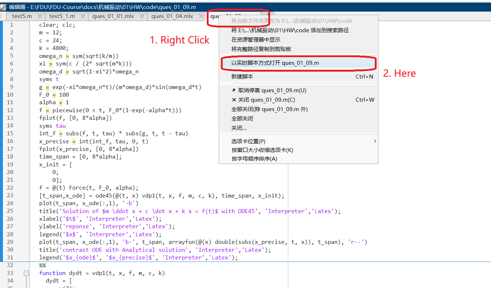

# 复旦课程

工研院

$$
\frac {\mathrm{d} life} {\mathrm{d} t} =
\begin{cases}
📕\text{(study)} &\quad \text{if your boss observes you}  \\
🐟\text{(slack off)} &\quad \text{if your lover observes you}
\end{cases}
$$

## 设计

### 非文本文件

git repository 存放个人自己所做的, 而 pdf 等之类的就 ignore, 最后将整体(pdf 之类的)放到网盘

技巧:

- 指定放入网盘的文件名满足`*-pan`的形式

### mlx 文件

- 使用[dzylikecode/matlab-file-converter](https://github.com/dzylikecode/matlab-file-converter)转化为 .m 文件上传到 GitHub, 而 .mlx 忽略
- 在 matlab 中 .m 文件可以方便地以 .mlx 形式打开

  

- 作业提交的时候, 可以两种形式一起提交, 方便查看, 用[dzylikecode/matlab-file-converter](https://github.com/dzylikecode/matlab-file-converter)转化

将这个步骤脚本化

## workflow

- 使用 drawio 画图, 保存为 svg
- [如何复制知乎文章中的公式 - 清北博客](https://blog.tsinbei.com/archives/1152/#mjx-eqn-eq)
- [MathType demo - For Developers](https://demo.wiris.com/mathtype/en/developers.php?_ga=2.154018814.778037287.1696334679-1067626557.1696334679)
- 学会使用 mathtype 提高公式编辑速度

## References

- [npubird/KnowledgeGraphCourse: 东南大学《知识图谱》研究生课程](https://github.com/npubird/KnowledgeGraphCourse)
- [致谢 - 《SEU 生存指南 2.0 - 东南大学生存指南 2.0》 - 极客文档](https://geekdaxue.co/read/chengqing-ddfhl@ckpcv7/cr8aqk)
- [README - SurviveSJTUManual](https://survivesjtu.gitbook.io/survivesjtumanual/)
- [Xin Peng's Homepage](https://cspengxin.github.io/)
- [Zhemin Yang](https://yangzhemin.github.io/)
