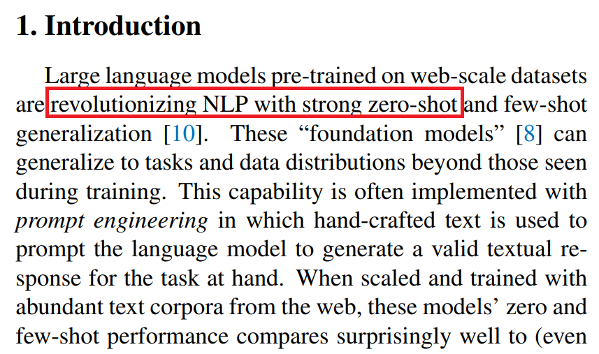

# week 11

## demo

## title

- "segment" refers to the process of image segmentation, which is the task of partitioning an image into multiple segments or regions, often to identify and isolate objects within the image.
- The term "anything" in this context highlights the model's versatile and wide-ranging capability in image segmentation. The Segment Anything Model is designed to handle a vast array of segmentation tasks, effectively being able to segment "anything" presented to it in the form of image prompts.

The title "Segment Anything" effectively captures the essence of the article, indicating its broad scope in image segmentation.

## introduction

- Context Setting: highlighting the impact of large language models pre-trained on web-scale datasets in revolutionizing natural language processing (NLP). This establishes the broader AI and machine learning landscape within which the research is situated.
- Identification of a Gap or Need: It implies a need for similar advancements in image segmentation, akin to the developments seen in NLP, suggesting the potential for foundation models in this domain.
- Research Objective or Aim: introducing a new task model and dataset for image segmentation.
- Significance and Novelty: the capability of the proposed model to generalize to tasks and data distributions beyond those seen during training.

## method

- Task Definition:
  The core idea is a promptable segmentation task. This task involves generating a valid segmentation mask based on any given segmentation prompt. These prompts can vary widely, including spatial or text information to specify what should be segmented in an image. The task is designed to be general enough to enable a broad range of applications, with a focus on flexibility and real-time interaction​​.
- Model Design (SAM):
  it consists of a powerful image encoder, a prompt encoder, and a lightweight mask decoder. The image encoder processes the image, the prompt encoder interprets the segmentation prompts, and the mask decoder combines these inputs to predict segmentation masks. This structure allows the reusing of image embeddings for different prompts, enhancing efficiency​​.
- Data Engine:
  To train SAM effectively, a large and diverse dataset is required. However, existing datasets were insufficient in scale and diversity. To address this, the researchers developed a "data engine", a model-in-the-loop system for dataset annotation. This engine has three stages: assisted-manual, semi-automatic, and fully automatic. Initially, SAM assists human annotators. In later stages, it takes on more autonomous roles in mask generation, ultimately leading to a fully automated process that significantly increases the scale and diversity of the dataset​​.
- SA-1B Dataset:
  The final outcome is the SA-1B dataset, a large-scale dataset comprising over 1 billion masks from 11 million licensed and privacy-respecting images. This dataset, collected using the final stage of the data engine, surpasses existing segmentation datasets in terms of size, quality, and diversity. It's intended not only for training SAM but also as a valuable resource for future research in foundational models for computer vision

## Result & Design

- Model Performance:
  SAM demonstrated impressive zero-shot performance across a wide range of tasks. Its ability to perform segmentation without prior specific training on the given task (zero-shot) was often competitive with or superior to fully supervised methods.
  Various statistical tests and comparisons with baseline models like RITM or ViTDet showed that SAM consistently achieved higher mask quality ratings. These tests involved a paired t-test on model scores and a paired bootstrap test to find confidence intervals for the difference in means, confirming the statistical significance of SAM's superior performance.
  Human evaluation studies further validated the quality of SAM’s masks, comparing them against state-of-the-art interactive segmentation models and ground truth datasets.
- Dataset Contribution (SA-1B):
  The SA-1B dataset, comprising over 1 billion masks from 11 million images, represents a significant contribution to the field. Its scale and diversity surpass existing segmentation datasets, and it is expected to be a valuable resource for future computer vision research.
  The dataset was created with a focus on privacy and diversity. Faces and license plates in images were blurred for privacy protection, and the dataset was noted for its geographic diversity, which is hoped to contribute to the development of fairer and more equitable models.
- Ethical Considerations and Impact:
  The article discusses the environmental impact of training large-scale models like SAM, acknowledging the carbon footprint associated with its training process.
  It also addresses potential biases and fairness concerns, recommending that users conduct their own fairness evaluations for specific use cases of SAM.
  The dataset and model are intended for research purposes, with a license agreement detailing permitted uses and restrictions.

## section

1. **Introduction** (10%):

   - Overview: This section sets the stage for the research, explaining the significance of large language models in NLP and identifying the need for similar advancements in image segmentation. It introduces the "Segment Anything" project, outlining its goals and potential impact.

2. **Methods** (40%):

   - 'Segment Anything Task': Details the new task model for image segmentation, discussing the challenges and methodology of creating a versatile segmentation model.
   - 'Segment Anything Model': Describes the architecture and technical details of the SAM model, including its training and unique features.
   - 'Segment Anything Dataset': Focuses on the SA-1B dataset used for training SAM, covering aspects like dataset size, diversity, and creation process.
   - 'Responsible AI Analysis': Addresses ethical considerations, including fairness, bias, and privacy in the development and application of SAM and SA-1B.

3. **Results** (20%):

   - 'Annotation Guidelines': Discusses the process of annotating the SA-1B dataset, providing insights into the quality control, challenges, and standards set for creating segmentation masks.

4. **Discussion** (20%):

   - 'Experiments': Presents the results from various experiments conducted to test SAM's performance, including zero-shot transfer experiments and comparisons with other models.

5. **Conclusion** (10%):
   - The final part of the article, summarizing key findings, the significance of the research, and potential areas for future exploration. It reflects on the impact of SAM in the field of image segmentation and broader AI applications.

## linguistic

Certainly! Here's a more detailed look at the linguistic features of the Introduction section of the "Segment Anything" article, with references to specific sentences and phrases:

1. **Authorship and Contribution**: The introduction begins with the listing of authors and their affiliations:

   - "Segment Anything
     Alexander Kirillov124 Eric Mintun2 Nikhila Ravi12 Hanzi Mao2 Chloe Rolland3 Laura Gustafson3"
     This layout is typical in scientific papers, providing clear information about the authors and their respective contributions and affiliations【99†source】.

2. **Technical Language and Terminology**: The language is highly technical, reflecting the specialized nature of the work:

   - "valid mask valid mask annotate"
     These terms are specific to the field of image segmentation and AI, indicating a focus on the technical aspects of model training and data annotation【100†source】.

3. **Conciseness and Focus**: The text is concise and directly focused on the core aspects of the research:

   - "model
     train"
     This phrase exemplifies the straightforward and focused language used in the paper, a characteristic feature of scientific writing where clarity and precision are essential【101†source】.

4. **Visual Imagery and Descriptive Language**: There's a use of visual descriptors to aid understanding:

   - "black ears"
     Such descriptive elements, although brief, provide visual imagery that can help in conceptualizing the research topic or the nature of the data involved【102†source】.

5. **Emphasis on Core Concepts**: The repetition of key concepts is used to emphasize the central ideas:
   - "prompt"
     Repeating important terms like this is a common linguistic technique in scientific literature to stress the primary focus of the research, in this case, the use of prompts in image segmentation【104†source】.

These linguistic features collectively provide a clear, concise, and technically detailed introduction to the research paper, setting the stage for a deeper understanding of the work presented in "Segment Anything".

---

The linguistic features of the Method section in the "Segment Anything" article are characterized by several key aspects:

1. **Technical and Specialized Vocabulary**:

   - The section uses highly specialized language, indicative of the technical and complex nature of the subject matter. For example:
     - "image encoder"
     - "1+ billion masks"
     - "11 million images"
     - "privacy respecting"
     - "licensed images"
       This vocabulary reflects the precision and specificity required in scientific discourse, particularly in fields like AI and computer vision【110†source】【111†source】.

2. **Numerical Data and Quantitative Descriptions**:

   - The text frequently employs numerical data and quantitative descriptions to convey the scale and scope of the research:
     - "over 1 billion masks"
     - "11M licensed and privacy respecting images"
       Such details are crucial in scientific writing to provide clear, measurable, and verifiable information about the research【112†source】【113†source】.

3. **Descriptive and Explanatory Phrases**:

   - Descriptions and explanations are used to clarify the purpose and functionality of the model and dataset:
     - "The model is designed and trained to be promptable so it can transfer zero-shot to new image distributions and tasks."
     - "We evaluate its capabilities on numerous tasks and find that its zero-shot performance is impressive."
       These phrases help in explaining complex concepts and methodologies in a comprehensible manner【113†source】【114†source】.

4. **Comparative Language**:

   - Comparative language is used to highlight the advancements and improvements made by the research:
     - "often competitive with or even superior to prior fully supervised results."
       This comparison with existing methods or results helps to position the research within the broader context of the field【113†source】.

5. **Contextual References to Related Work**:
   - The text makes reference to related work and concepts in the field to provide context and background:
     - "Large language models pre-trained on web-scale datasets are revolutionizing NLP with strong zero-shot and few-shot generalization."
       Such references serve to connect the current research with broader trends and developments in the field【115†source】.

Overall, the linguistic features of the Method section in the "Segment Anything" article include the use of technical and specialized vocabulary, numerical data, descriptive and explanatory phrases, comparative language, and contextual references. These features are typical of scientific writing, particularly in a field as advanced and specialized as AI and computer vision.

---

To analyze the linguistic features of the "Results and Discussion" and other sections of the article with direct references from the text, focusing on the specific perspectives you mentioned:

### Empirical and Data-Driven Language:

- **Example**: "We extensively evaluate SAM. First using a diverse new suite of 23 segmentation datasets we find that SAM produces high-quality masks from a single foreground point often only slightly below that of the manually annotated ground truth"【7†source】.
- **Analysis**: This statement is a clear example of empirical and data-driven language, emphasizing the extensive evaluation of the model and its comparative performance to ground truth.

### Analytical and Interpretative Statements:

- **Example**: "These results suggest that SAM can be used out-of-the-box with prompt engineering to solve a variety of tasks involving object and image distributions beyond SAM’s training data"【7†source】.
- **Analysis**: This interpretative statement speculates on the potential applications of SAM, going beyond the empirical data to suggest broader usability.

### Comparative Analysis:

- **Example**: "Our dataset SA-1B consists of 11M diverse high-resolution licensed and privacy protecting images and 1.1B high-quality segmentation masks collected with our data engine. We compare SA-1B with existing datasets"【10†source】.
- **Analysis**: This segment highlights the comparative analysis aspect, where the SA-1B dataset is contrasted with existing datasets to underscore its uniqueness and comprehensiveness.

### Use of Visual Aids:

- **Example**: "SAM has three components illustrated in Fig. 4: an image encoder, a flexible prompt encoder, and a fast mask decoder"【8†source】.
- **Analysis**: This reference to a figure illustrates the use of visual aids to complement the textual description of the SAM model’s components.

### Cautious and Qualified Statements:

- **Example**: "Nevertheless, room for improvement remains as we discuss in §8"【7†source】.
- **Analysis**: This statement exemplifies cautious language, acknowledging the potential areas for improvement in SAM.

### Future Directions:

- **Example**: This aspect isn’t explicitly quoted in the provided excerpts, but the discussion of potential applications and improvements indirectly suggests future directions for research.

### Technical Vocabulary and Jargon:

- **Example**: "The image encoder runs once per image and can be applied prior to prompting the model... Mask decoder. The mask decoder efficiently maps the image embedding, prompt embeddings, and an output token to a mask"【8†source】.
- **Analysis**: This excerpt is rich in technical vocabulary, indicating the specialized nature of the language appropriate for an expert audience.

### Contextual References to Related Work:

- **Example**: "We build on Transformer vision models [14, 33, 20, 62] with specific tradeoffs for (amortized) real-time performance"【8†source】.
- **Analysis**: This reference to existing Transformer vision models situates SAM within the context of ongoing developments in the field, connecting it to broader research trends.

In summary, the linguistic features of these sections are characterized by a blend of empirical data presentation, analytical interpretations, comparative analyses, and technical language, complemented by visual aids and contextual references to related work. This blend reflects the article's aim to communicate complex scientific findings and situates the research within the broader context of advancements in AI and machine learning.
