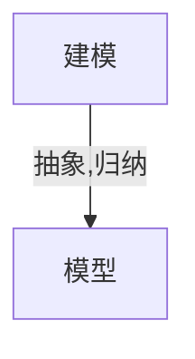

# 动力学模型和问题

动力学: dynamic 与力学中的不是一个意思, 翻译的问题. 本意是指代动态, 系统的状态随时间演化的过程

一般考虑$+\infty$时候

## 动力学模型

### 计算器

> 输入任意数, 反复按某个函数键

- 状态: 显示数
- 时间演化: 按键次数

eg. 初始输入$x$, 反复按 $\exp$ 键盘, 得到序列

$$x, e^x, e^{e^x}, e^{e^{e^x}}, \cdots$$

建模:

- 状态: $x_0$
- 时间演化: $x_{n+1} = e^{x_n}$

抽象:

$$x_0, f(x_0), f(f(x_0)), f(f(f(x_0))), \cdots$$

即

$$x_{t+1} = f(x_t)$$

### 虫口模型

虫口, 人口

> 成虫产卵之后自然死亡, 每个虫卵可孵化一只虫子

设第$n$年虫子数量为$P_n$, 每只成虫平均产卵$c$个($c$为参数)

$$P_{n+1}=cP_n$$

称之为线性定常差分方程

容易求解: $P_n = c^nP_0$

- 若$c>1$, 则$P_n$随$n$指数增长
- 若$0<c<1$, 则$P_n$趋于 0
- 若$c=1$, 则$P_n$为常数

在$c \leq 1$时, 看起来比较合理, 而$c>1$时, 虫子数量会爆炸, 但是现实当中, 虫子数量不会爆炸, 到了一定数量之后, 不满足指数增长, 因而$c>1$时, 模型过于简化

需要考虑: 空间, 食物有限, 竞争, 传染病, 天敌等

以竞争为例, 假设虫子两两相遇就有一定概率死亡

$P_n$只虫子, 有$C_{P_n}^2$中情况, 所以死亡数量$\sim P_n^2$

$$P_{n+1} = cP_n - \alpha P_n^2$$

标准化: 将$P_n = \frac{P_n}{\beta}$进行换元, 则

$$P_{n+1} = \lambda P_n(1-P_n) \quad \lambda > 0$$

称之为 logistic 差分方程

抽象为:

$$x_{t+1} = f(\mu, x_t)$$

称之为异界定常差分方程( $f$ 和 $n$ 无直接依赖关系), $\mu$为参数

> 也许有$t+0.5$这样的情况, 但是可以通过$t_n = t_0 + n \Delta t$映射为$n+1$

有些问题:

- f 无法显示表达
- f 随时间变化

3 层神经网络可以逼近任何函数

离散动力系统: 下一时刻的状态由当前的状态决定

### 人口模型

> 当总数很大时, 可近似地认为种群数量随时间连续的, 甚至可微地变化

$$N^{\prime}(t) = cN(t) \quad \text{Malthus} 生物总数增长定律$$

一阶线性常微分方程, 其中$N(t)$为种群数量, $N^{\prime}(t)$为出生率与死亡率之差

解得:

$$N(t) = N(0)e^{ct}$$

取 1961 年为$t=0$, $N(0)=3.06 \times 10^9$, $c=0.02$, 则

$$N(t)=3.06 \times 10^9 e^{0.02t}$$

计算 2670 年总数为$3.06 \times 10^15$, 不合理

考虑竞争:

$$N^{\prime}(t) = aN - b N^2 \quad 生物总数增长统计筹算律$$

一阶非线性定常微分方程

解得:

$$N(t) = \frac{a N_0}{b N_0 + (a-b N_0)e^{-a (t-t_0)}} \quad N(t_0) = N_0$$

当$t \to \infty$时, $N(t) \to \frac{a}{b}$

估计

$$
\begin{aligned}
    a &= 0.029 \\
    b &= 2.941 \times 10^{-12} \\
    \Rightarrow \frac{a}{b} &= 9.86 \times 10^{9}
\end{aligned}
$$

其中, 利用$c = a - b N$进行估计$b$

可得, 以百亿为饱和极限

### 具有阻尼的单摆运动方程
