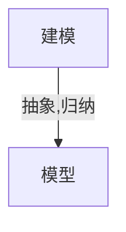
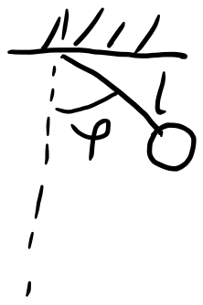

# 动力学模型和问题

- time:2023-09-05

动力学: dynamic 与力学中的不是一个意思, 翻译的问题. 本意是指代动态, 系统的状态随时间演化的过程

一般考虑$+\infty$时候

## 动力学模型

### 计算器

> 输入任意数, 反复按某个函数键

- 状态: 显示数
- 时间演化: 按键次数

eg. 初始输入$x$, 反复按 $\exp$ 键盘, 得到序列

$$x, e^x, e^{e^x}, e^{e^{e^x}}, \cdots$$

建模:

- 状态: $x_0$
- 时间演化: $x_{n+1} = e^{x_n}$

抽象:

$$x_0, f(x_0), f(f(x_0)), f(f(f(x_0))), \cdots$$

即

$$x_{t+1} = f(x_t)$$



### 虫口模型

虫口, 人口

> 成虫产卵之后自然死亡, 每个虫卵可孵化一只虫子

设第$n$年虫子数量为$P_n$, 每只成虫平均产卵$c$个($c$为参数)

$$P_{n+1}=cP_n$$

称之为线性定常差分方程

容易求解: $P_n = c^nP_0$

- 若$c>1$, 则$P_n$随$n$指数增长
- 若$0<c<1$, 则$P_n$趋于 0
- 若$c=1$, 则$P_n$为常数

在$c \leq 1$时, 看起来比较合理, 而$c>1$时, 虫子数量会爆炸, 但是现实当中, 虫子数量不会爆炸, 到了一定数量之后, 不满足指数增长, 因而$c>1$时, 模型过于简化

需要考虑: 空间, 食物有限, 竞争, 传染病, 天敌等

以竞争为例, 假设虫子两两相遇就有一定概率死亡

$P_n$只虫子, 有$C_{P_n}^2$中情况, 所以死亡数量$\sim P_n^2$

$$P_{n+1} = cP_n - \alpha P_n^2$$

标准化: 将$P_n = \frac{P_n}{\beta}$进行换元, 则

$$P_{n+1} = \lambda P_n(1-P_n) \quad \lambda > 0 \quad \text{logistic 差分方程}$$

抽象为:

$$x_{t+1} = f(\mu, x_t)$$

称之为异界定常差分方程( $f$ 和 $n$ 无直接依赖关系), $\mu$为参数

> 也许有$t+0.5$这样的情况, 但是可以通过$t_n = t_0 + n \Delta t$映射为$n+1$

有些问题:

- f 无法显示表达
- f 随时间变化

3 层神经网络可以逼近任何函数

离散动力系统: 下一时刻的状态由当前的状态决定

### 人口模型

> 当总数很大时, 可近似地认为种群数量随时间连续的, 甚至可微地变化

$$N^{\prime}(t) = cN(t) \quad \text{Malthus} 生物总数增长定律$$

一阶线性常微分方程, 其中$N(t)$为种群数量, $N^{\prime}(t)$为出生率与死亡率之差

解得:

$$N(t) = N(0)e^{ct}$$

取 1961 年为$t=0$, $N(0)=3.06 \times 10^9$, $c=0.02$, 则

$$N(t)=3.06 \times 10^9 e^{0.02t}$$

计算 2670 年总数为$3.06 \times 10^15$, 不合理

考虑竞争:

$$N^{\prime}(t) = aN - b N^2 \quad \text{生物总数增长统计筹算律}$$

一阶非线性定常微分方程

解得:

$$N(t) = \frac{a N_0}{b N_0 + (a-b N_0)e^{-a (t-t_0)}} \quad N(t_0) = N_0$$

当$t \to \infty$时, $N(t) \to \frac{a}{b}$

估计

$$
\begin{aligned}
    a &= 0.029 \\
    b &= 2.941 \times 10^{-12} \\
    \Rightarrow \frac{a}{b} &= 9.86 \times 10^{9}
\end{aligned}
$$

其中, 利用$c = a - b N$进行估计$b$

可得, 以百亿为饱和极限

### 具有阻尼的单摆运动方程



物体向上摆动

$$m l \frac{d^2 \varphi}{d t^2} = - mg \sin \varphi - b \frac{d \varphi}{d t}$$

其中, $m$为质量, $l$为摆长, $g$为重力加速度, $b$为阻尼系数

二阶定常非线性微分方程

当$\varphi$非常小的时候, $\sin \varphi \approx \varphi$, 则可以用来线性化

### Brussel 振子模型

> 描述化学反应中间产物浓度的演化

#### 无扩散无强迫驱动

$$
\begin{cases}
    \frac{dx}{dt} = A - (B+1)x + x^2 y \\
    \frac{dy}{dt} = Bx - x^2 y
\end{cases}
$$

二维非线性定常微分方程组

#### 无扩散有强迫周期驱动

$$
\begin{cases}
    \frac{dx}{dt} = A - (B+1)x + x^2 y + \alpha \cos \omega t \\
    \frac{dy}{dt} = Bx - x^2 y
\end{cases}
$$

通过引入新变量升维, 消除$\cos \omega t$项

$$
\begin{cases}
    \frac{dx}{dt} = A - (B+1)x + x^2 y + \alpha u \\
    \frac{dy}{dt} = Bx - x^2 y \\
    \frac{du}{dt} = \omega v \\
    \frac{dv}{dt} = -\omega u
\end{cases} \quad u(0) = 1, v(0) = 0
$$

!> 不要遗漏约束

#### 有扩散

$$
\begin{cases}
    \frac{\partial x}{\partial t} = A - (B+1)x + x^2 y + D_x \Delta x \\
    \frac{\partial y}{\partial t} = Bx - x^2 y + D_y \Delta y
\end{cases}
$$

其中$\Delta = \nabla^2$为[拉普拉斯算子](https://en.wikipedia.org/wiki/Laplace_operator)

定常偏微分方程

### 时间连续型的 Hp field 人工神经网络模型(ANN)

$$\frac{d x_i (t)}{dt} = - \frac{1}{\tau} x_i(t) + \sum_{j=1}^{N} \omega_{ij}F\left[ x_j(t) \right] + I_i$$

- $x_i(t)$为第$i$个神经元在$t$时刻的状态
- $\tau$为时间常数
- $\omega_{ij}$为连接权重
- $F$为激活函数, 如 sigmoid 函数
- $I_i$为外部输入

### 时滞差分/微分方程

记忆效应

> 火箭燃烧的控制理论中

$$\frac{d x(t)}{dt} + (1-n) x(t) + n x(t-\tau) = 0$$

> 麻疹传播模型

$$\frac{d s(t)}{dt} = \beta s(t) \left[ s(t-12) - s(t-14) - 2r \right] + r$$

其中, $s(t)$为易感人群, $r$为补充人群, $\beta$为传染率, $12$为潜伏期, $14$为传染期, 麻疹的上下限

这样的微分方程和其他有本质的不同, 属于无限维, 初始条件可能需要给出$\left[-\tau, 0 \right]$上的函数

## 动力学问题

$$x_n=f(x_{n-1})$$

最终或渐进性态如何?

对于[计算器](#计算器)

- $\exp \rightarrow +\infty$
- $\sin \rightarrow 0$
- $\cos \rightarrow x_0 \quad x_0 = \cos x_0$

对于[虫口模型](#虫口模型)

$$
f(x)=3.2x(1-x) \rightarrow
\begin{cases}
    0 \rightarrow 0 \\
    0.6875 \rightarrow 0.6875 \quad \text{不动点}\\
    \left[ 0, 1 \right] \rightarrow 0.5130, 0.7995
\end{cases}
$$

$$
f(x)=3.839x(1-x) \rightarrow \left( 0, 1 \right) \rightarrow 0.1498, 0.4198, 0.9593 \quad \text{周期解}
$$

$$f(x)=4x(1-x) \rightarrow \left( 0, 1 \right) \rightarrow \text{无规则游荡 混沌}$$

### 基本演化结果

```markmap
- 不动点吸引子
- P周期解吸引子(离散) | 极限环吸引子(连续)
- 奇异吸引子 | 混沌吸引子
```

$$\frac{d \vec{x}}{dt} = \vec{f}(\vec{x})$$

一般的, $\vec{f}$认为充分光滑, 设解的区间为$(-\infty, +\infty)$, 考虑终态或渐近态

考虑[人口模型](#人口模型)

平衡态: 不动点, 平衡位置, 只需$N^{\prime}(t) = 0$

- $N_0 = \frac{b}{a}, N = \frac{a}{b}$, 给一个扰动仍然在这, 稳定, 不动点吸引子
- $N_0 =0, N = 0$, 给一个扰动不会在这点, 不稳定, 排斥子

?> 如何判断不动点的稳定性?

### 构造出来的

$$
\begin{cases}
    \frac{dx}{dt} = x - y - x(x^2 + y^2) \\
    \frac{dy}{dt} = x + y - y(x^2 + y^2)
\end{cases}
$$

显然, $x=0, y=0$是不同点

根据结构容易观察, 用极坐标容易解耦

$$
\begin{cases}
    \frac{dr}{dt}=r(1-r^2)\\
    \frac{d\theta}{dt}=1
\end{cases}
$$

- $r=0$
- $r=1 \rightarrow$ 闭轨线, 周期解 -> 孤立, 极限环

其他情况呢? 如何判别稳定性? 比如给一个干扰

### Lorenz 方程

> 大气层热对流问题

$$
\begin{cases}{\frac {\mathrm {d} x}{\mathrm {d} t}}&=\sigma (y-x)\\[6pt]{\frac {\mathrm {d} y}{\mathrm {d} t}}&=x(\rho -z)-y\\[6pt]{\frac {\mathrm {d} z}{\mathrm {d} t}}&=xy-\beta z\end{cases}
$$

eg. $\sigma = 10, r = 28, b = \frac{8}{3}$

三个不动点 $(0, 0, 0), (6\sqrt{2}, 6\sqrt{2}, 27), (-6\sqrt{2}, -6\sqrt{2}, 27)$ 均不稳定


Lorenz 奇异吸引子

有界非周期解

引出混沌的概念, 对初值敏感

> 数学上证明无法精确预测, 只能靠算力堆积

[Lorenz system - Wikipedia](https://en.wikipedia.org/wiki/Lorenz_system)

$\frac{dx}{dt} = f(t, x)$ 离散化 $x_{n+1} = g(n, x_n)$

利用差商极限

$$x(t+\Delta t) = x(t) + \Delta t \frac{dx}{dt}$$

这就是一个迭代式

利用折线近似拟合, 称之为积分曲线(欧拉折线法)

$$x_{k+1}=x_k + \Delta \cdot f(k \Delta, x_k)$$

当$\Delta \to 0$时, $\{x_k\} \to x(t)$

> 可以根据陡峭程度, 调整$\Delta$, 优化解的速度

Neural ODE

物理规律嵌入到神经网络中

$$\frac{dx}{dt} \leftrightarrow x_{k+1}=a x(t)$$

## References

- [应用数学方法 1 动力学模型和问题 - 知乎](https://zhuanlan.zhihu.com/p/654489812)
