# HW-01

## problem 01

|                              |                              |                              |
| ---------------------------- | ---------------------------- | ---------------------------- |
| 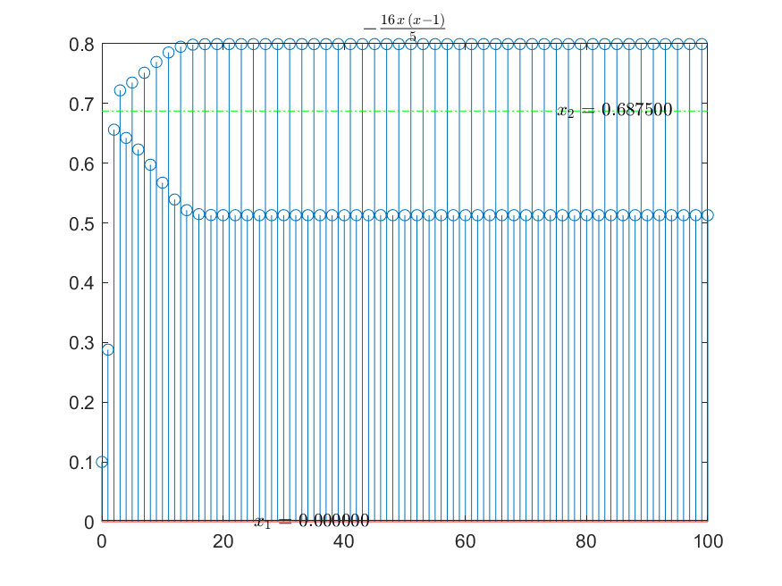 | 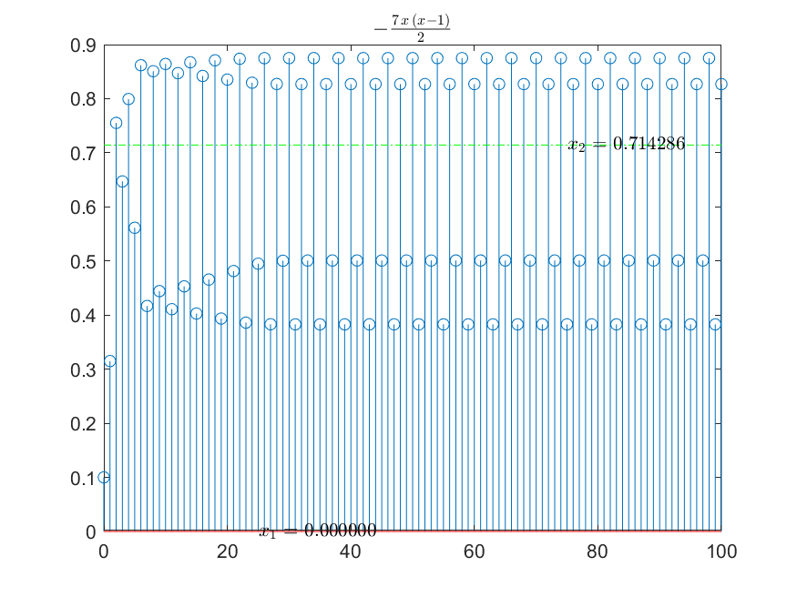 | 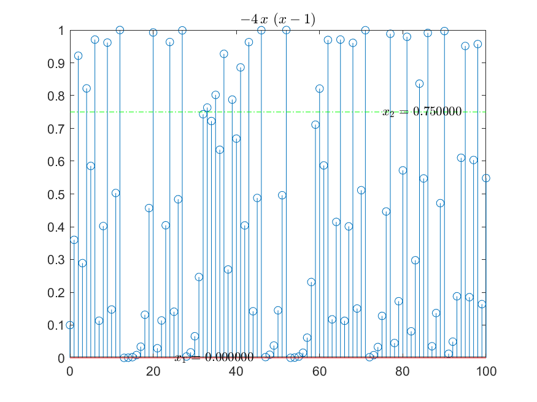 |

## problem 02

## problem 03

### References

- [数学分析笔记（八）——多变量函数微分学（进阶） - 知乎](https://zhuanlan.zhihu.com/p/43234672)

## problem 04

## problem 05

|                  1D                  |                  2D                  |
| :----------------------------------: | :----------------------------------: |
| 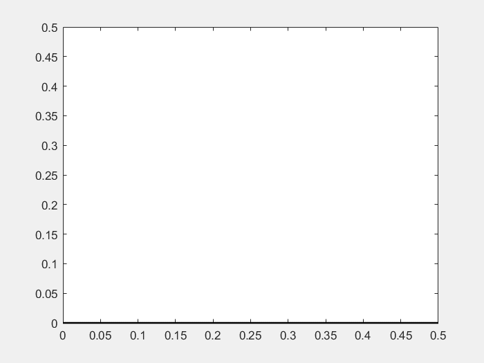 | 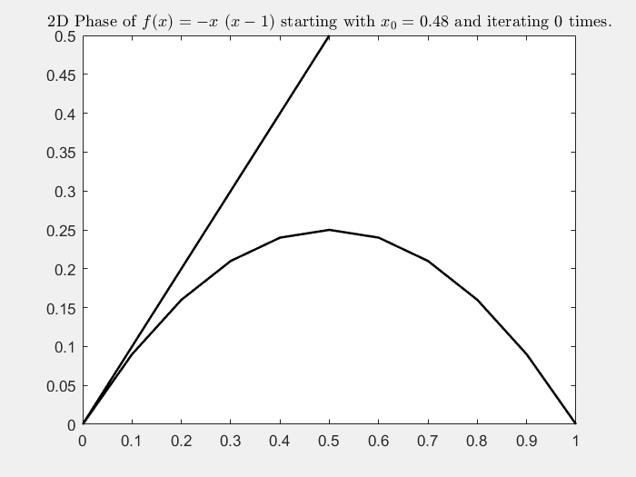 |
| 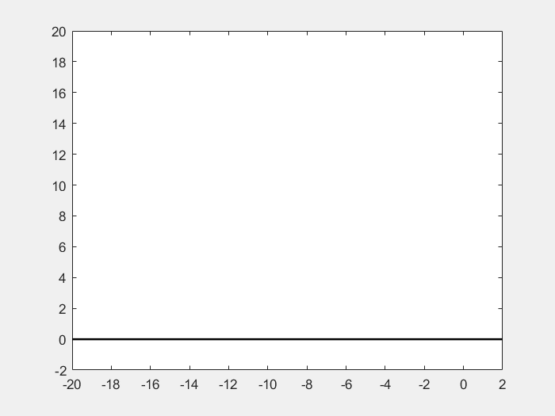 | 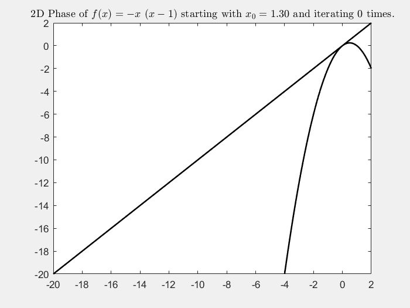 |
| 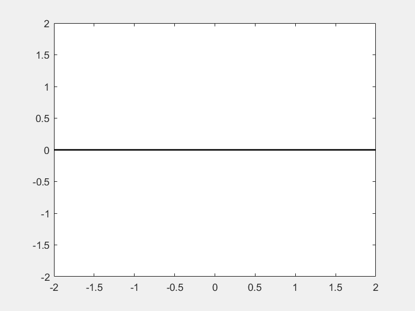 | 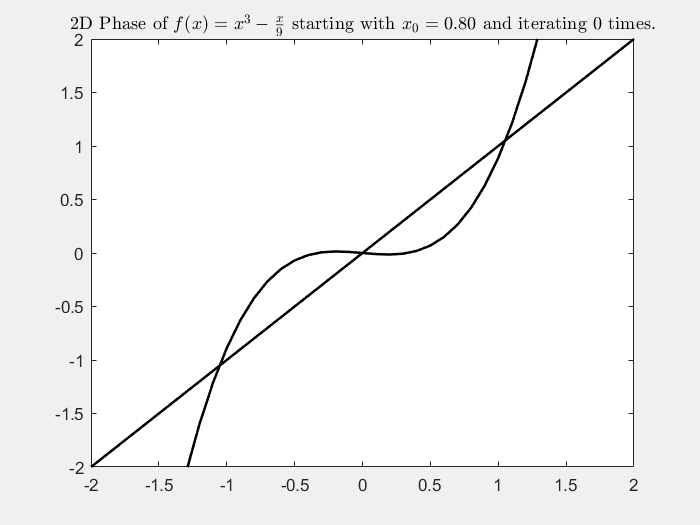 |
| 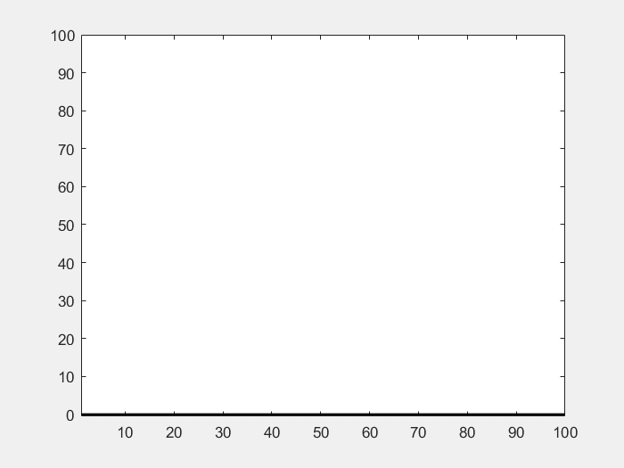 | 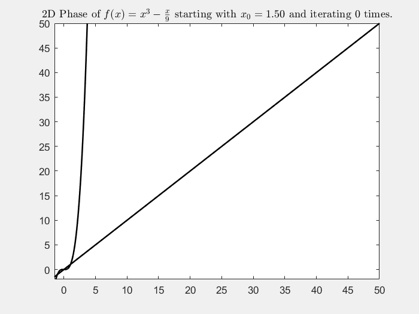 |
| 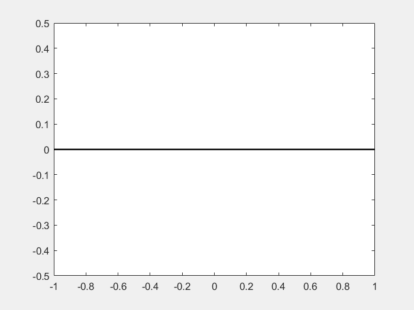 | 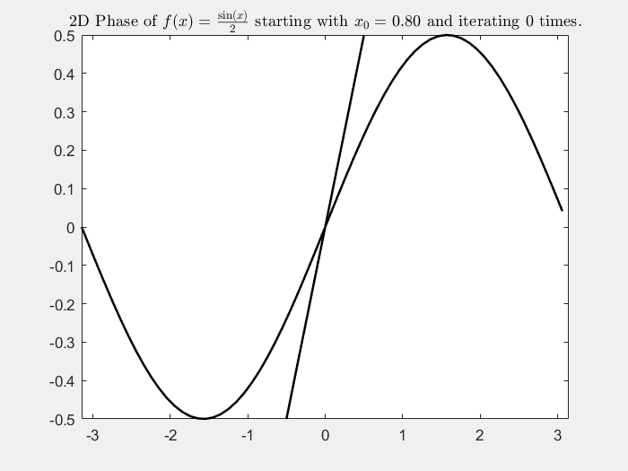 |
| 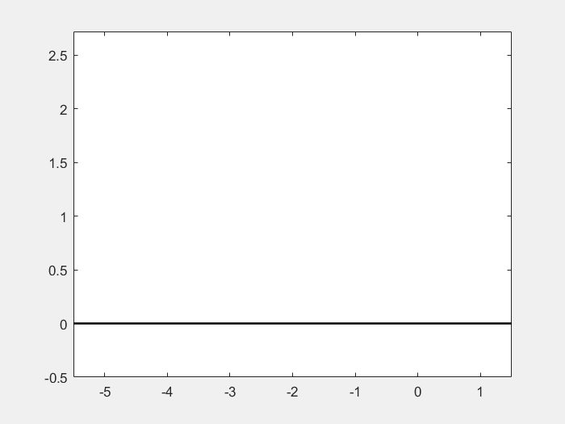 | 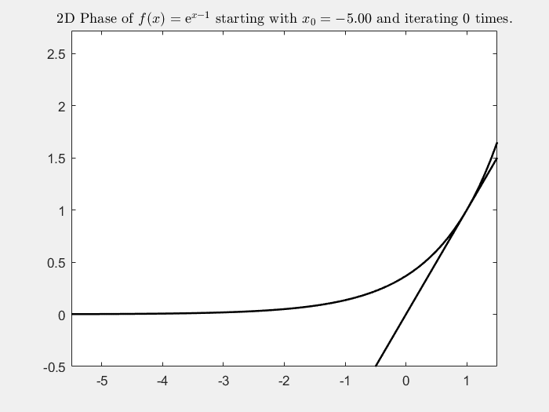 |
| 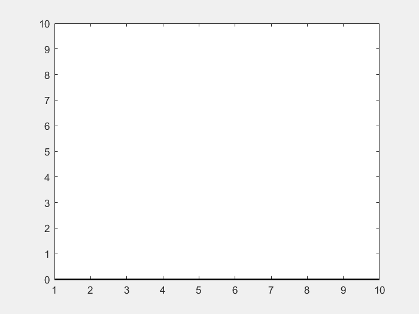 | 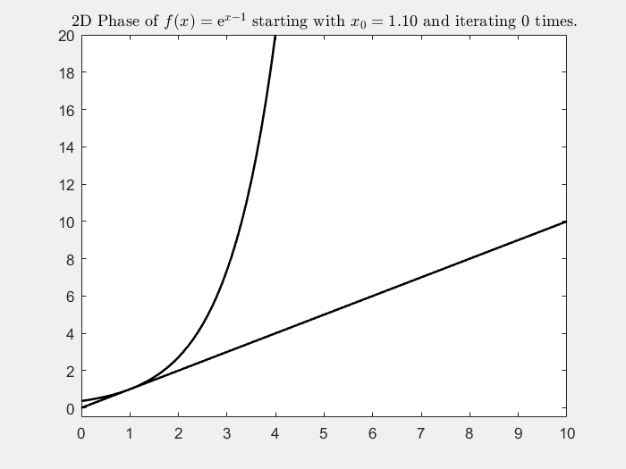 |

### issue

- curve_arrow 函数超出范围后会出错

### improve

- 可以用对数坐标查看更广的范围
- 对于循环迭代, 可以使用 alpha 通道叠加图片, 将很久之前的轨迹逐渐淡出, 就像有一定记忆性一样

## problem 06

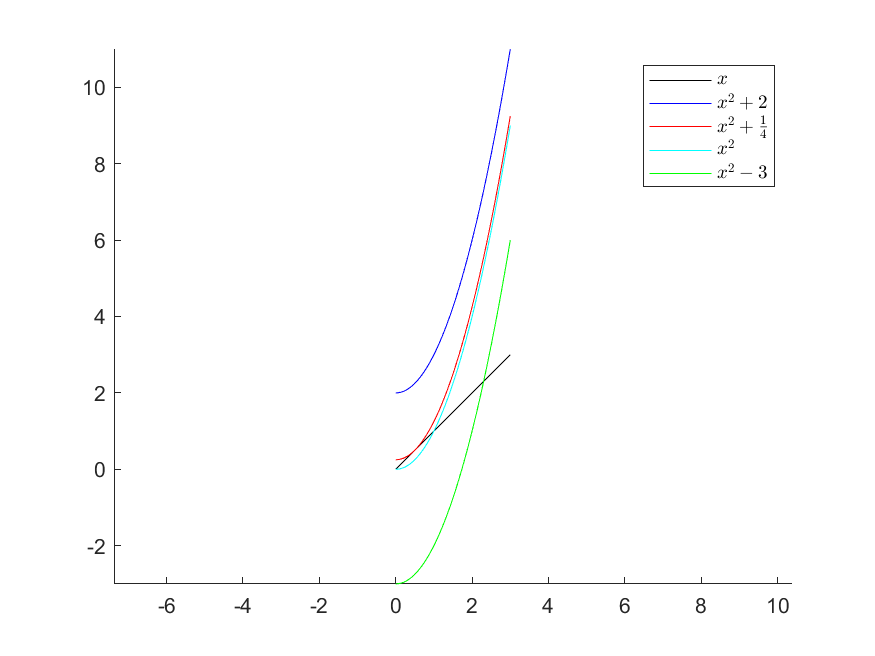

### References

- [Animation Playback Controls in Live Scripts (R2021a) » File Exchange Pick of the Week - MATLAB & Simulink](https://blogs.mathworks.com/pick/2021/03/26/animation-playback-controls-in-live-scripts-r2021a/#respond), 但是我的程序在实时脚本里面不会显示动画, 在 m 文件中才可以正常显示
- [Displaying GIF Image Matlab - MATLAB Answers - MATLAB Central](https://www.mathworks.com/matlabcentral/answers/36160-displaying-gif-image-matlab) 在 mlx 显示保存的 gif 图片

## fix

双曲和吸引与排斥不是包含关系, 所以下结论需要判定是双曲吸引子还是非双曲吸引子
