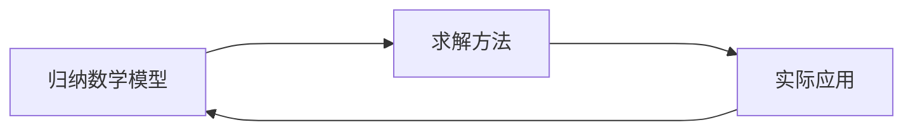

# 应用数学方法

考核: 期中 30%, 期末 70% (可以改交论文, 但是至多 B)

应用数学仍是理论, 只不过问题有背景



```markmap
- 确定顶动力学模型和方法
  - 离散时间演化(差分)
  - 连续时间演化(常微分)
  - 时空演化(偏微分)
- 随机模型和方法
- 优化规划模型和方法
```

- 可以添加一些 matlab 代码

- 捕食
- 共生
- 竞争

改变符号, 二者互相影响

三生万物的重要推论 -> 孩子生三个, 共勉

速度是连续变化的

## topic

提供一些论文选题供大家参考：

1. Kuramoto 模型的介绍和实现
2. 利用神经网络求解微分方程的方法研究
3. 谣言传播模型的建立与分析
4. 混沌的研究历史和应用
5. 种群竞争模型的建立与分析
6. 神经元模型（可选 IF，FHN，HR 等）的介绍和分析
7. 循环神经网络/储备池计算网络的介绍和实现
8. 平衡点的控制方法介绍及实现

---

趋同, 同步现象

- 比如鼓掌, 走路步伐

可能存在耦合

网络图

考虑有限时间内

更多地感受到可以用很多近似的工具去分析, 逼近的思想很重要

对称的可分析, 但是太偏数学了

同步分群, 出现博弈行为

本质上是几何观点, 向量场

---

R 的含义:

- 物理隔离
- 药物回复
- 疫苗

## References

- [rios - 知乎](https://www.zhihu.com/people/swstbe-54/posts) 上课笔记
