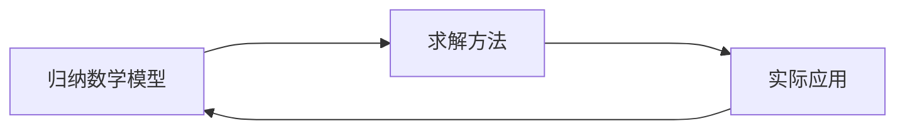

# 应用数学方法

考核: 期中 30%, 期末 70% (可以改交论文, 但是至多 B)

应用数学仍是理论, 只不过问题有背景



```markmap
- 确定顶动力学模型和方法
  - 离散时间演化(差分)
  - 连续时间演化(常微分)
  - 时空演化(偏微分)
- 随机模型和方法
- 优化规划模型和方法
```

- 可以添加一些 matlab 代码

## References

- [rios - 知乎](https://www.zhihu.com/people/swstbe-54/posts) 上课笔记
