# HW-mid

## problem 01

## problem 02

## problem 03

### 3-1

|                  1D                  |                  2D                  |
| :----------------------------------: | :----------------------------------: |
| 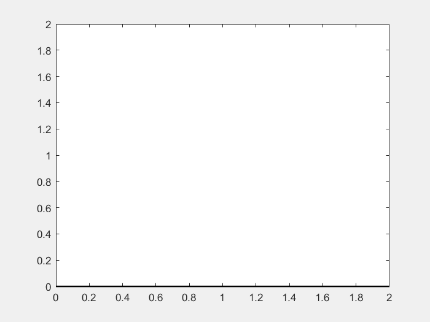 |  |
|  | 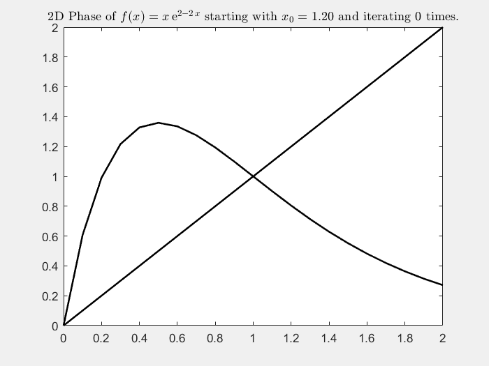 |

### 3-2

|                                     |                                     |                                     |
| :---------------------------------: | :---------------------------------: | :---------------------------------: |
| 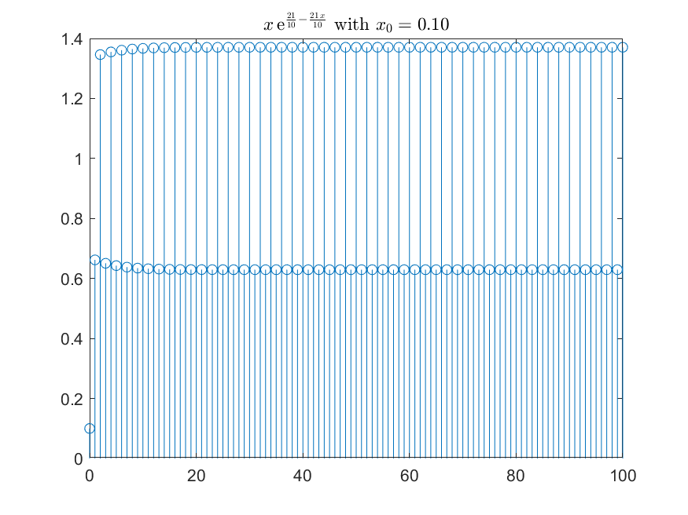 | 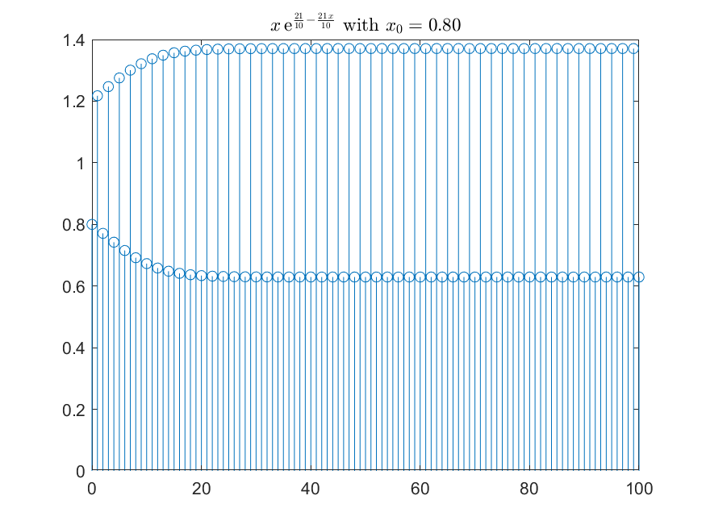 | 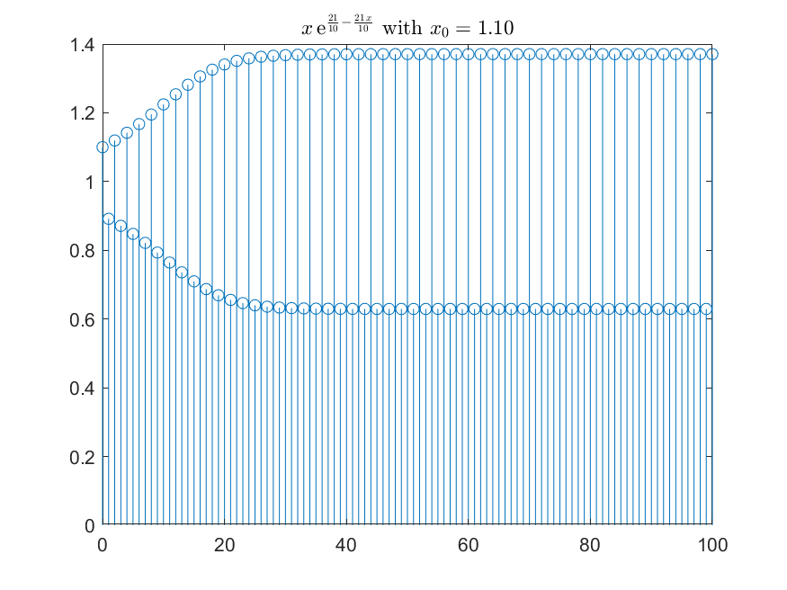 |

### 3-3

|                                     |                                     |                                     |
| :---------------------------------: | :---------------------------------: | :---------------------------------: |
| 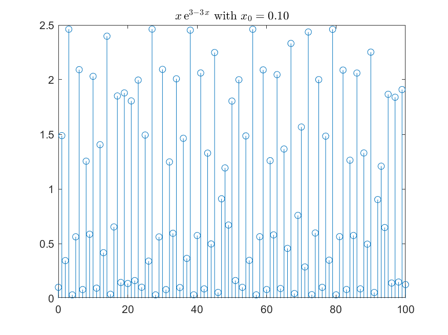 | 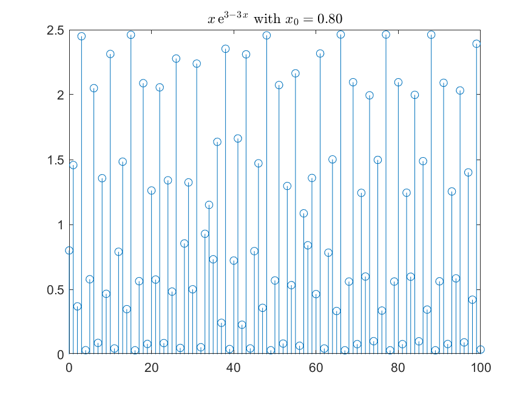 | 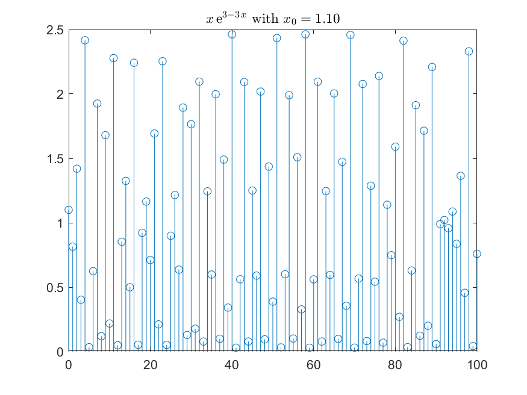 |

### 3-4

|                                     |                                     |                                     |
| :---------------------------------: | :---------------------------------: | :---------------------------------: |
| 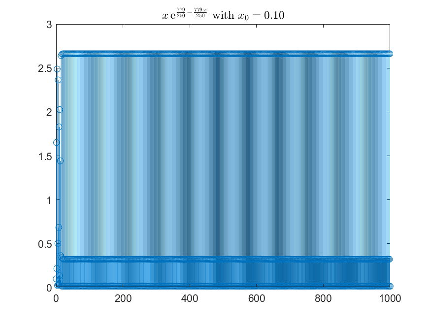 |  | 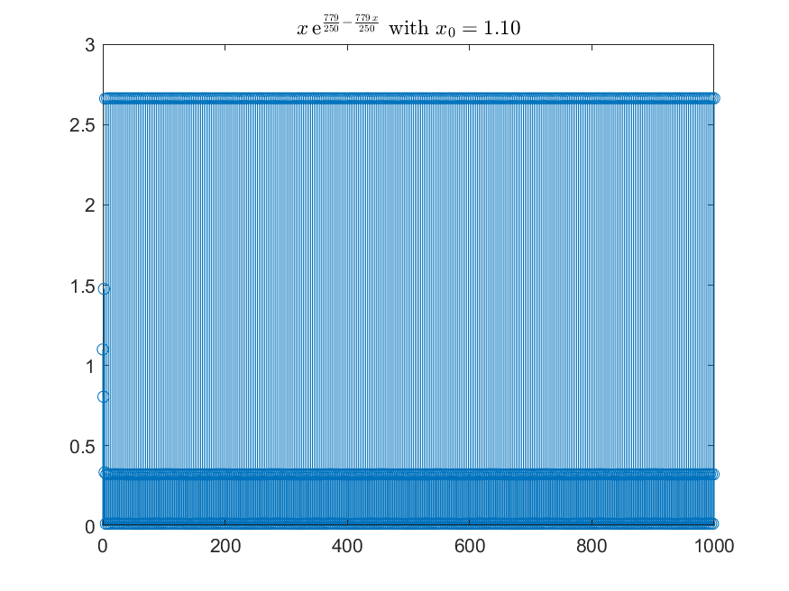 |

## problem 04

### 4-3

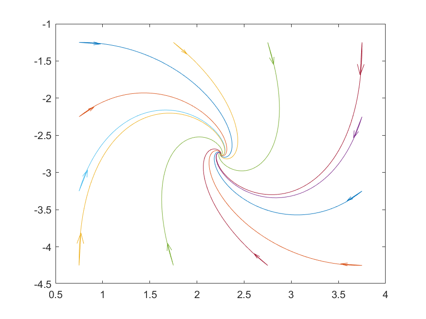

## problem 05

