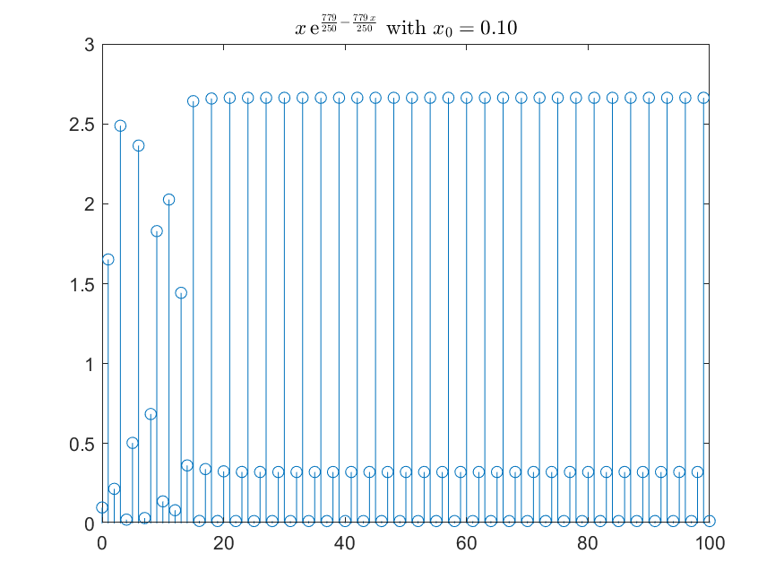
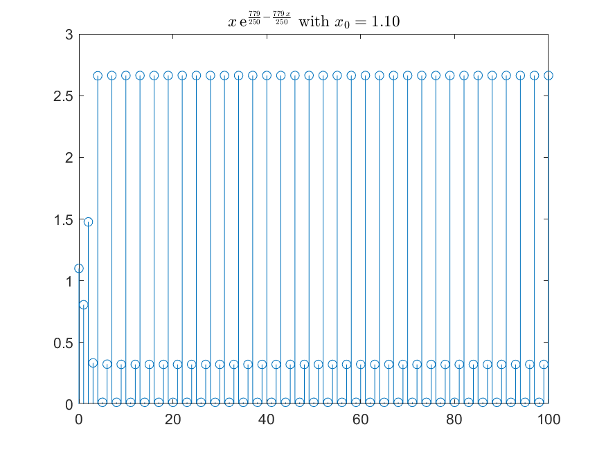

# HW-mid

## problem 01

## problem 02

## problem 03

### 3-1

|                  1D                  |                  2D                  |
| :----------------------------------: | :----------------------------------: |
|  |  |
|  |  |

### 3-2

|                                     |                                     |                                     |
| :---------------------------------: | :---------------------------------: | :---------------------------------: |
|  |  |  |

典型轨道特点: 迭代次数足够多, 轨道逐渐吸引到 2-周期轨道上

matlab 计算 10000 次, Lyapunov 指数 $l = -0.2521$

$$
\begin{align*}
    l(0.1) &= -0.2521\\
    l(0.8) &= -0.2521\\
    l(1.1) &= -0.2521\\
\end{align*}
$$

### 3-3

|                                     |                                     |                                     |
| :---------------------------------: | :---------------------------------: | :---------------------------------: |
|  |  |  |

典型轨道特点: 轨道是混沌的

matlab 计算 10000 次, Lyapunov 指数随初始值变化

$$
\begin{align*}
    l(0.1) &= 0.3871\\
    l(0.8) &= 0.3853\\
    l(1.1) &= 0.3872\\
\end{align*}
$$

### 3-4

|                                     |                                     |                                     |
| :---------------------------------: | :---------------------------------: | :---------------------------------: |
|  |  |  |

典型轨道特点: 迭代次数足够多, 轨道逐渐吸引到 3-周期轨道上

matlab 计算 10000 次, Lyapunov 指数 $l = -1.2329$

$$
\begin{align*}
    l(0.1) &= -1.2329\\
    l(0.8) &= -1.2329\\
    l(1.1) &= -1.2329\\
\end{align*}
$$

## problem 04

### 4-3

奇点$\begin{pmatrix}
    \frac{9}{4} \\
    -\frac{11}{4}
\end{pmatrix}$周围充满了盘旋去向该奇点的轨迹，故该奇点为焦点

## problem 05

