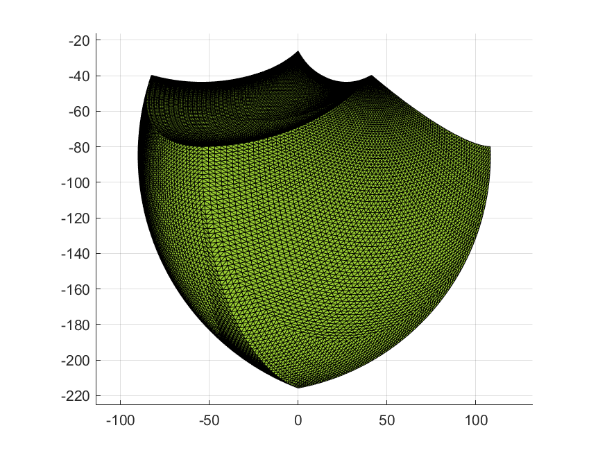
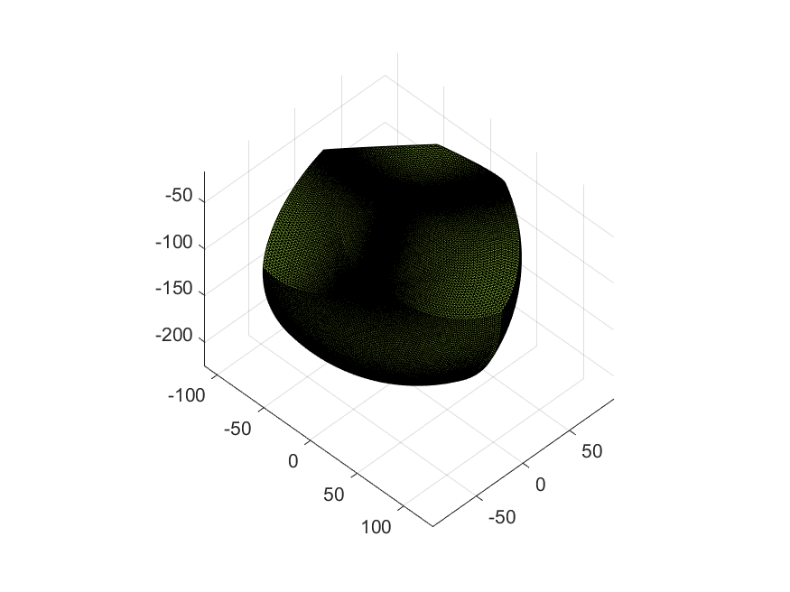
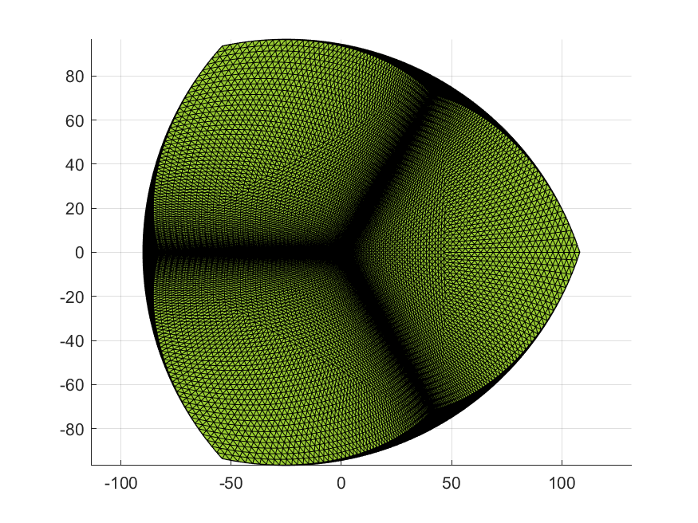

# delta 机构

|                         |                         |                         |
| :---------------------: | :---------------------: | :---------------------: |
|  |  |  |

## Reference

- [Delta 机器人：运动学正反解分析\_delta 机构-CSDN 博客](https://blog.csdn.net/qq413886183/article/details/106993725)
- [已知三维空间中三个点求圆心坐标和半径 - kongbursi - 博客园](https://www.cnblogs.com/kongbursi-2292702937/p/15190825.html)
