# HW-03

## problem 01

|                              |                              |                              |
| :--------------------------: | :--------------------------: | :--------------------------: |
| 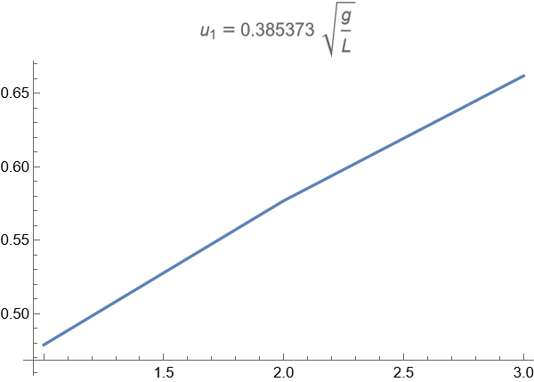 | 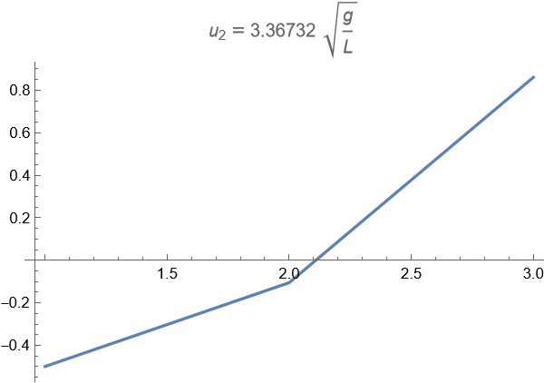 | 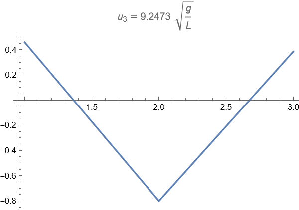 |

## problem 02

|                              |                              |
| :--------------------------: | :--------------------------: |
| 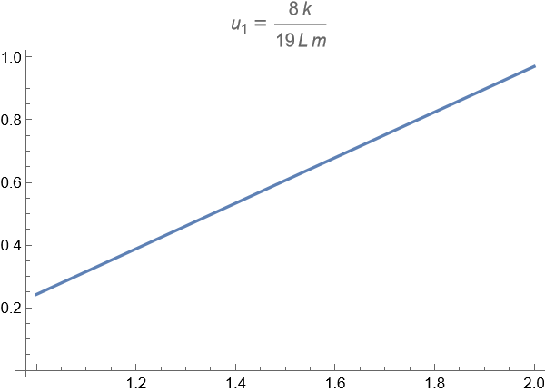 | 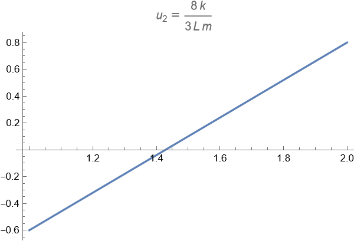 |

## problem 03

|                              |                              |
| :--------------------------: | :--------------------------: |
| 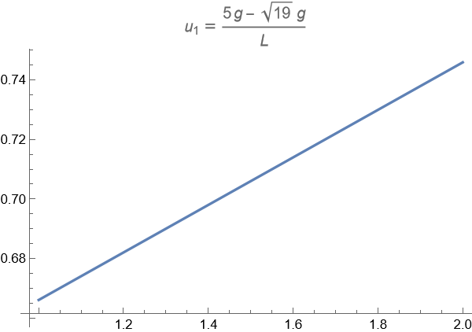 | 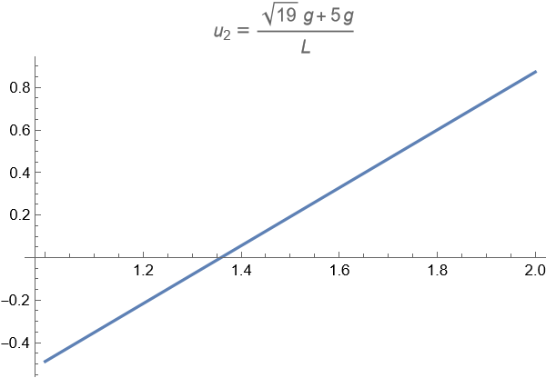 |

## problem 04

## problem 05

## problem 06

## problem 07

|                              |                              |                              |
| :--------------------------: | :--------------------------: | :--------------------------: |
| 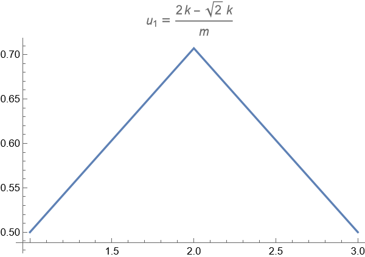 | 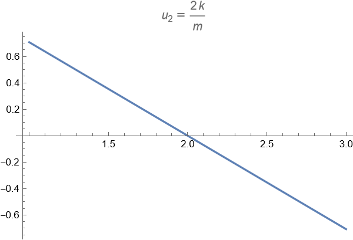 | 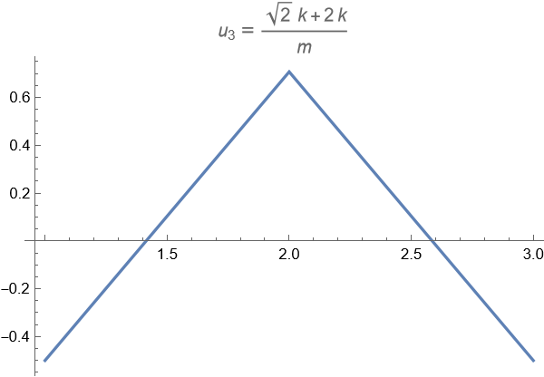 |

- 模态振型(1)表明，第一次和最后一次位移相同，方向相反，而中间弹簧保持静止
- 模态振型(2)表示首尾弹性位移相同且方向相同，中间位移较大且方向相反
- 模态振型(3)表示三个位移方向相同，中间一个比另一个大

|                                 |                                 |                                 |
| :-----------------------------: | :-----------------------------: | :-----------------------------: |
| 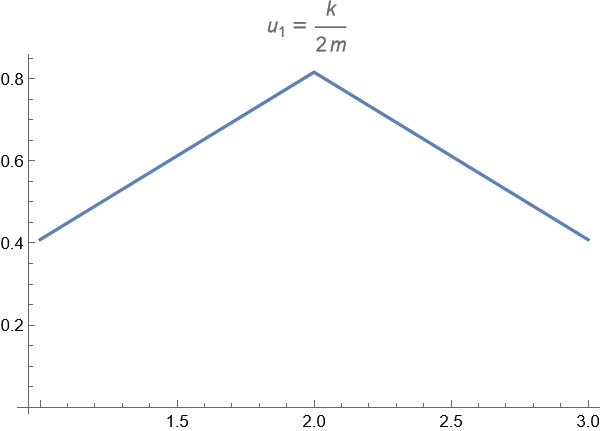 |  | 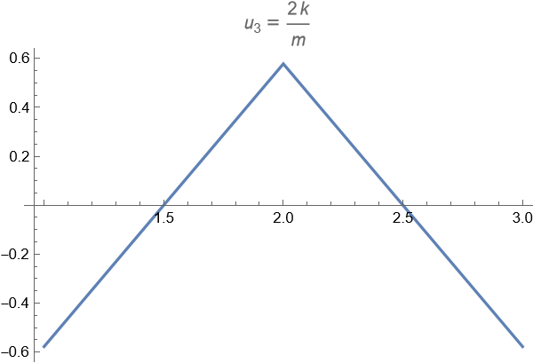 |

对比:  
可以发现, 第 1, 3 阶模态振型均遵循"上升-下降"趋势，左右端值相同; 第二固有频率对应的形状相同. 但第一和第三振型的斜率并不相同
解释:  
$m_2$ 和 $m_3$ 质量较大, 惯性较大, 增大了中间弹簧的振动幅度. 需要较大的弹簧压缩量才能将动力能转化为弹性势能.

