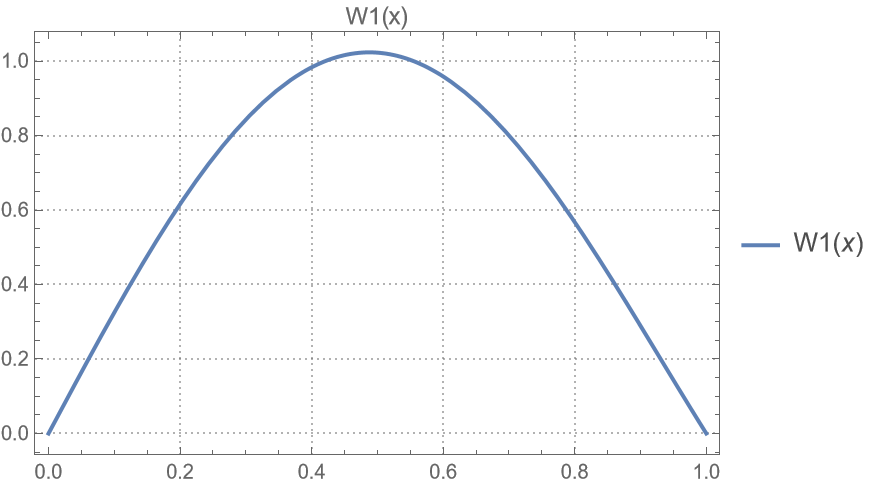

# HW-04

## problem 01

|                                 |                                 |                                 |                                 |
| :-----------------------------: | :-----------------------------: | :-----------------------------: | :-----------------------------: |
|  |  |  |  |

- 刚体模态可以看作是$\omega=0$, 因此
  $$W^{(4)} = \frac{m\omega^2}{EI}W = 0$$

  与其他模态正交

- 利用振型叠加法$w(x, t) = \sum W_i(x)\eta_i(t)$时，刚体模态与其余模态正交时才能将各个模态解耦

## problem 02

## problem 03

## problem 04

|                                 |                                 |                                 |
| :-----------------------------: | :-----------------------------: | :-----------------------------: |
|  |  |  |

可以看到第一模态占主导, 第二模态最小

## problem 05

