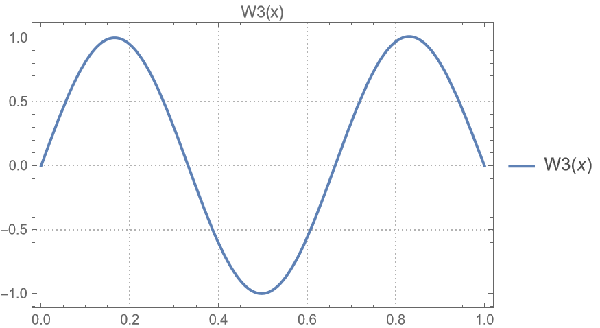

# HW-04

## problem 01

|                                 |                                 |                                 |                                 |
| :-----------------------------: | :-----------------------------: | :-----------------------------: | :-----------------------------: |
|  |  |  |  |

- 刚体模态可以看作是$\omega=0$, 因此
  $$W^{(4)} = \frac{m\omega^2}{EI}W = 0$$

  与其他模态正交

- 利用振型叠加法$w(x, t) = \sum W_i(x)\eta_i(t)$时，刚体模态与其余模态正交时才能将各个模态解耦

## problem 02

### a

当$k = \frac{0.5 \text{EA}}{L}$时

$${\beta _1}L \approx 2.975,\;\;{\beta _2}L \approx 6.203,\;\;{\beta _3}L \approx 9.371$$

|                                 |                                 |                                 |
| :-----------------------------: | :-----------------------------: | :-----------------------------: |
|  |  |  |

b

### b

当$k = \frac{2 \text{EA}}{L}$时

$${\beta _1}L \approx 2.459,\;\;{\beta _2}L \approx 5.959,\;\;{\beta _3}L \approx 9.211$$

|                                         |                                         |                                         |
| :-------------------------------------: | :-------------------------------------: | :-------------------------------------: |
|  |  |  |

刚度为 $k$ 的系统的第一, 第二和第三模态对应于无弹簧系统的第二, 第三和第四模态

## problem 03

|                                 |                                 |                                 |
| :-----------------------------: | :-----------------------------: | :-----------------------------: |
|  |  |  |

## problem 04

|                                 |                                 |                                 |
| :-----------------------------: | :-----------------------------: | :-----------------------------: |
|  |  |  |

可以看到第一模态占主导, 第二模态最小

## problem 05

