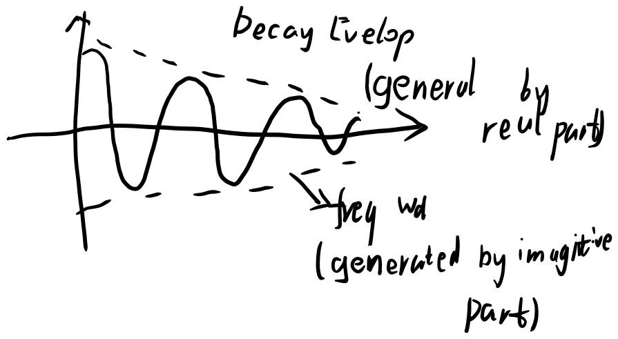
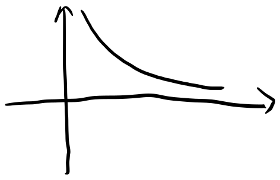
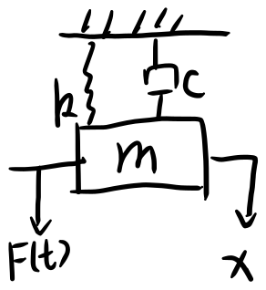
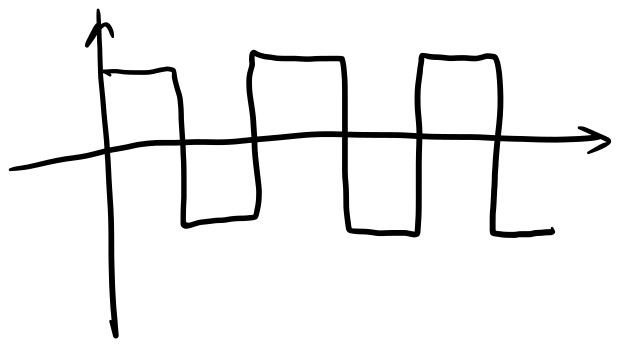
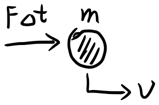

# 机械振动

$$m\ddot{x}+c\dot{x}+kx=F(t)$$

标准化:

$$\ddot{x}+2\zeta\omega_n\dot{x}+\omega_n^2x=\frac{F(t)}{m}$$

其中, $\omega_n=\sqrt{\frac{k}{m}}$为系统的固有频率, $\zeta=\frac{c}{2\sqrt{km}}$为系统的阻尼比

$$x = x_h + x_p$$

- $x_h$为齐次解(通解), Transient
- $x_p$为特解, Steady State

- Free Response Problem

Assume:

$$x_h = Ae^{rt}$$

characteristic equation:

$$r^2+2\zeta\omega_nr+\omega_n^2=0$$

Eigenvalues:

$$r_{1,2}=-\zeta\omega_n\pm\omega_n\sqrt{\zeta^2-1}$$

### under damped

$\zeta<1$, Underdamped, $r_{1,2}=-\zeta\omega_n\pm j\omega_n\sqrt{1-\zeta^2}$, conjugate complex pair

$$x_1(t) = e^{st} = e^{-\zeta\omega_nt + j\omega_n\sqrt{1-\zeta^2}t}$$

$$x_2(t) = e^{st} = e^{-\zeta\omega_nt - j\omega_n\sqrt{1-\zeta^2}t}$$

$x_1(t)$ and $x_2(t)$ are linearly independent, so the general solution is:

$$x_h(t) = \alpha x_1(t) + \beta x_2(t) = e^{-\zeta\omega_nt}(\alpha e^{j\omega_n\sqrt{1-\zeta^2}t} + \beta e^{-j\omega_n\sqrt{1-\zeta^2}t})$$

Homogeneous solution: (complex form) use Euler's formula

$$x_h(t) = e^{-\zeta\omega_nt}(\alpha \sin(\omega_n\sqrt{1-\zeta^2}t) + \beta \cos(\omega_n\sqrt{1-\zeta^2}t))$$

$$x_h(t) = e^{-\zeta\omega_nt} \sqrt{\alpha^2+\beta^2} \sin(\omega_dt + \phi)$$

where $\phi = \tan^{-1}(\frac{\beta}{\alpha})$

$\omega_d = \omega_n\sqrt{1-\zeta^2}$ is the damped natural frequency

$\phi$ is the phase angle

$\alpha$ and $\beta$ or $A$ and $B$ are determined by the initial conditions

### undamped

special case:

$\zeta=0$, Undamped, $r_{1,2}=\pm j\omega_n$, conjugate complex pair

$$x_h(t) = A \sin(\omega_nt) + B \cos(\omega_nt) = \sqrt{A^2+B^2} \sin(\omega_nt + \phi)$$

where $\phi = \tan^{-1}(\frac{B}{A})$

$\zeta=1$, Critically Damped, $r_{1,2}=-\omega_n$, repeated real roots

$$x_h(t) = (A+Bt)e^{-\omega_nt}$$

### overdamped

$\zeta>1$, Overdamped, $r_{1,2}=-\zeta\omega_n\pm\omega_n\sqrt{\zeta^2-1}$, real roots

$$x_h(t) = Ae^{r_1t} + Be^{r_2t}$$

---

substitute initial conditions $x(0)$ and $\dot{x}(0)$ to solve for $A$ and $B$

eg. for underdamped system:

$$x_(t) = e^{-\zeta\omega_nt} [x(0)\cos(\omega_dt) + \frac{\dot{x}(0)+\zeta\omega_nx(0)}{\omega_d}\sin(\omega_dt)]$$

Eigenvalues:

$$S = \begin{bmatrix} -\zeta\omega_n & \omega_n\sqrt{1-\zeta^2} \\ -\omega_n\sqrt{1-\zeta^2} & -\zeta\omega_n \end{bmatrix}$$

$$S = \Delta + \zeta\omega_nI$$

where $\Delta = - \zeta\omega_n I$

Real part of eigenvalues: $-\zeta\omega_n$

- $\Delta < 0$, $e^{\Delta t}$ Decay $\Rightarrow$ Stable
- $\Delta > 0$, $e^{\Delta t}$ Growth $\Rightarrow$ Unstable
- $\Delta = 0$, $e^{\Delta t}$ Constant $\Rightarrow$ Marginally Stable

Imaginary part of eigenvalues:

- $\omega_d = 0$, No oscillation

> eg. door closer is equipped with a spring and a damper, the spring is used to close the door, the damper is used to prevent the door from slamming

## particular solution

under harmonic excitation:

steady state response for $F(t) = F_0\sin(\omega_f t)$ or $F(t) = F_0 e^{j\omega_f t}$

$$m\ddot{x}+c\dot{x}+kx=F_0\sin(\omega_f t)$$

assume:

$$x_p = C \sin(\omega_f t) + D \cos(\omega_f t)$$

substitute into the equation:

$$-\omega_f^2 C \sin(\omega_f t) - \omega_f^2 D \cos(\omega_f t) + 2\zeta\omega_n\omega_f D \sin(\omega_f t) - 2\zeta\omega_n\omega_f C \cos(\omega_f t) + \omega_n^2 C \sin(\omega_f t) + \omega_n^2 D \cos(\omega_f t) = \frac{F_0}{m}\sin(\omega_f t)$$

equate $\sin$ and $\cos$ terms:

$$\begin{cases} (-\omega_f^2 + \omega_n^2)C + 2\zeta\omega_n\omega_f D = \frac{F_0}{m} \\ (-\omega_f^2 + \omega_n^2)D - 2\zeta\omega_n\omega_f C = 0 \end{cases}$$

solve for $C$ and $D$:

$$\begin{cases} C = \frac{F_0}{m\sqrt{(\omega_n^2-\omega_f^2)^2+(2\zeta\omega_n\omega_f)^2}} \\ D = \frac{2\zeta\omega_n\omega_f}{m\sqrt{(\omega_n^2-\omega_f^2)^2+(2\zeta\omega_n\omega_f)^2}} \end{cases}$$

$$x_p = \frac{F_0}{m\sqrt{(\omega_n^2-\omega_f^2)^2+(2\zeta\omega_n\omega_f)^2}} \sin(\omega_f t) + \frac{2\zeta\omega_n\omega_f}{m\sqrt{(\omega_n^2-\omega_f^2)^2+(2\zeta\omega_n\omega_f)^2}} \cos(\omega_f t) = \frac{F_0}{m\sqrt{(\omega_n^2-\omega_f^2)^2+(2\zeta\omega_n\omega_f)^2}} \sin(\omega_f t + \phi)$$

where $\phi = \tan^{-1}(\frac{2\zeta\omega_n\omega_f}{\omega_n^2-\omega_f^2})$

- $x = x_h + x_p$
- $x_h$: transient response will disappear
- $x_p$: steady state response dominates

## so far

Topic: General Forcing Function

solution methods

- Periodic: Fourier Series
- Non-periodic: Laplace Transform or Convolution Integral

Numerical Methods (ODE solvers)

## Fourier Series

### Fourier Series

$$f(t) = \frac{a_0}{2} + \sum_{n=1}^{\infty} a_n \cos(n\omega_0 t) + \sum_{n=1}^{\infty} b_n \sin(n\omega_0 t)$$

where $\omega_0 = \frac{2\pi}{T}$
$$a_0 = \frac{2}{T} \int_{t_0}^{t_0+T} f(t) dt$$
$$a_n = \frac{2}{T} \int_{t_0}^{t_0+T} f(t) \cos(n\omega_0 t) dt$$
$$b_n = \frac{2}{T} \int_{t_0}^{t_0+T} f(t) \sin(n\omega_0 t) dt$$

or

$$f(t) = \frac{a_0}{2} + \sum_{n=1}^{\infty} A_n \cos(n\omega_0 t + \phi_n)$$

where $A_n = \sqrt{a_n^2+b_n^2}$ and $\phi_n = \tan^{-1}(\frac{b_n}{a_n})$

- given a periodic function
- write $F(t)$ into Fourier Series
- solve $m\ddot{x}+c\dot{x}+kx=F(t)$ for each term

  $$\begin{cases} m\ddot{x}+c\dot{x}+kx=\frac{a_0}{2} \\ m\ddot{x}+c\dot{x}+kx=a_n \cos(n\omega_0 t) \\ m\ddot{x}+c\dot{x}+kx=b_n \sin(n\omega_0 t) \end{cases}$$

- sum up the solutions

[Fourier series - Wikipedia](https://en.wikipedia.org/wiki/Fourier_series)

## Non-periodic

Recall Impulse Response of a given input $F(t)$

- Impulse = change of linear momentum

$$F \Delta t =\Delta (m v)$$

when $\Delta t \rightarrow 0$, impact problem
