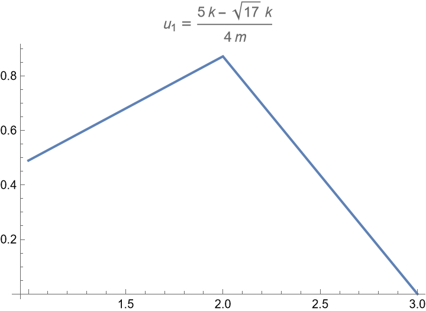
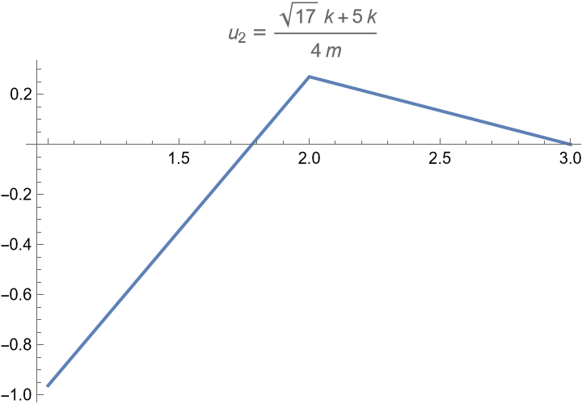
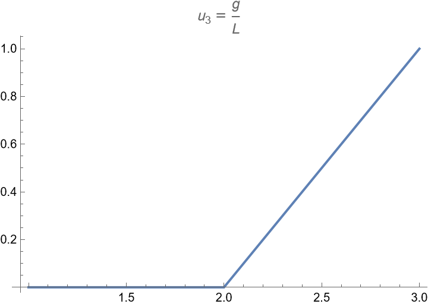
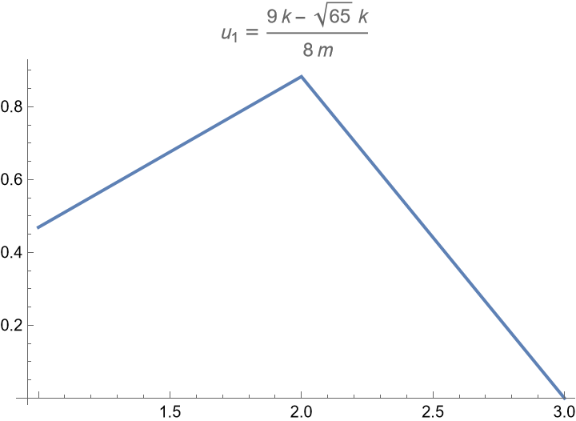
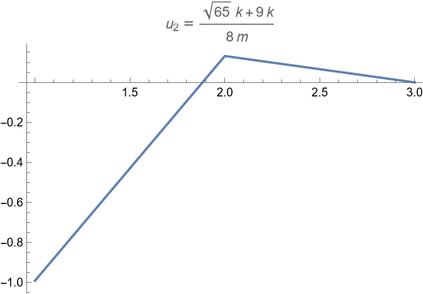
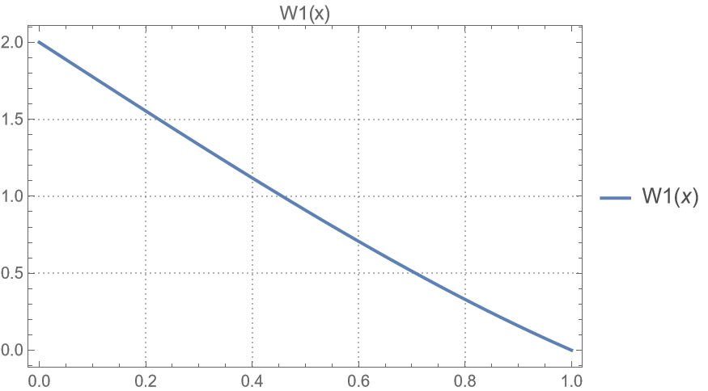
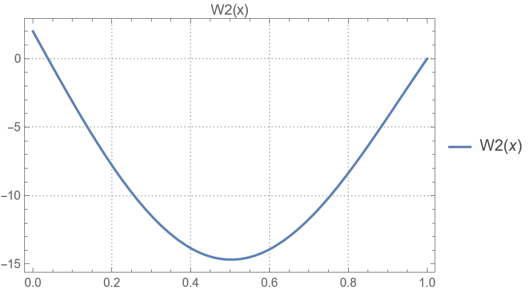
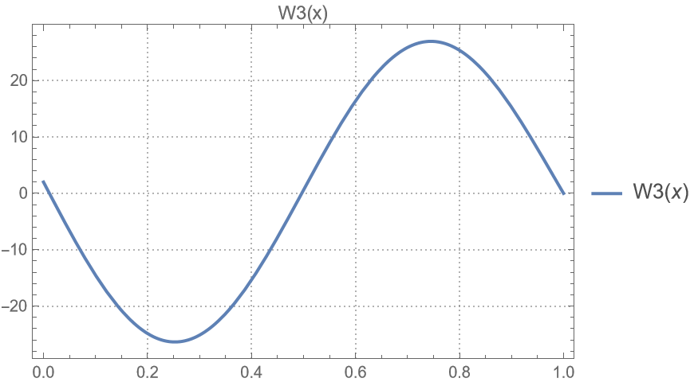

# final

## exam-01

|                              |                              |                              |
| :--------------------------: | :--------------------------: | :--------------------------: |
|  |  |  |

由图可知

1. $u_1, u_2$同向振动, 且$u_2$的振幅较大, $theta$不振动
2. $u_1, u_2$反向振动, 且$u_1$的振幅较大, $theta$不振动
3. $u_1, u_2$不振动, 仅$theta$振动

|                              |                              |                              |
| :--------------------------: | :--------------------------: | :--------------------------: |
|  |  |  |

比较:

1. $u_1$振幅较大
2. $u_2$振幅较小
3. $theta$独立$u_1, u_2$振动

## exam-02

|                              |                              |                              |
| :--------------------------: | :--------------------------: | :--------------------------: |
|  |  |  |

