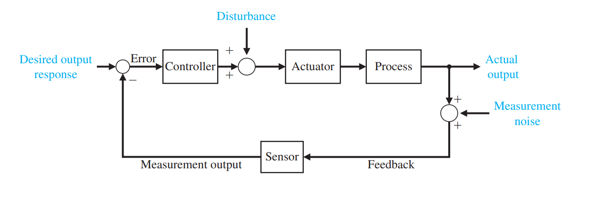
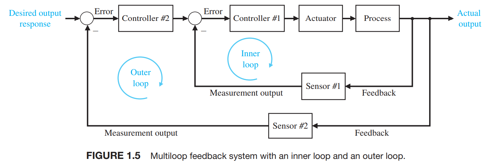
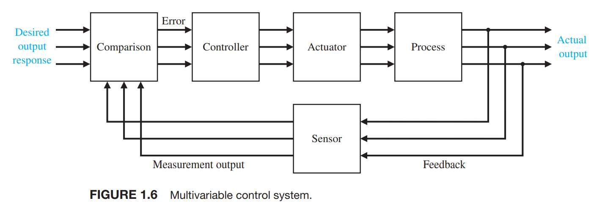

# 现代控制理论

> We believe that the most important and productive approach to learning is for each of us to rediscover and re-create anew the answers and methods of the past. Thus, the ideal is to present the student with a series of problems and questions and point to some of the answers that have been obtained over the past decades. The traditional method—to confront the student not with the problem but with the finished solution—is to deprive the student of all excitement, to shut off the creative impulse, to reduce the adventure of humankind to a dusty heap of theorems. The issue, then, is to present some of the unanswered and important problems that we continue to confront, for it may be asserted that what we have truly learned and understood, we discovered ourselves.

- [Dorf Series | Pearson](https://media.pearsoncmg.com/bc/abp/engineering-resources/products/series.html#series=Dorf)
  - [Engineering Resources | Pearson](https://media.pearsoncmg.com/bc/abp/engineering-resources/products/product.html#product,isbn=0134407628)
- [Modern Control Systems 13th.pdf](https://files.crazt.moe/temp/Modern%20Control%20Systems%2013th.pdf)

## 2023-09-08

考虑傅里叶变换与能量建立的联系 -> gpt?

改变被控对象和添加控制器, 想到了代码的 proxy 模式, 可能被控对象很难更改

灵敏度

状态转移矩阵

## 23-09-15

disturbance is placed between the controller and the actuator, which is quite common sense.

|                                     |                                     |
| ----------------------------------- | ----------------------------------- |
|  |  |

等效, 可以将#1 的误差输入向前移动, 只需要除以 G
