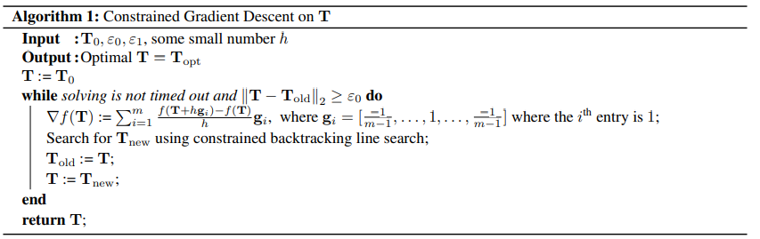

- 轨迹规划：https://zhuanlan.zhihu.com/p/419830521
- 背景介绍：https://www.cnblogs.com/zhjblogs/p/15083627.html
- 文章框架：https://www.bilibili.com/read/cv21722130/
- 中文翻译：https://blog.csdn.net/weixin_43180028/article/details/105103208（需要CSDN会员）
- PPT 制作：https://zhuanlan.zhihu.com/p/641086199
- 微分平坦公式推导：https://zhuanlan.zhihu.com/p/569996018
- 复现代码：https://zhuanlan.zhihu.com/p/488080630
- 优化求解：https://blog.csdn.net/liuerin/article/details/117357208
- https://blog.csdn.net/liuerin/article/details/117359135
- 文章整体理解: [Minimum Snap Trajectory Generation - 知乎](https://zhuanlan.zhihu.com/p/529485809)

- [经典论文翻译--Minimum Snap Trajectory Generation and Control for Quadrotors-CSDN 博客](https://blog.csdn.net/weixin_43180028/article/details/105103208)
- [四旋翼无人机的动力学模型及控制 - 知乎](https://zhuanlan.zhihu.com/p/641086199)
- [Minimum Snap Trajectory Generation and Control for Quadrotors - 知乎](https://zhuanlan.zhihu.com/p/488080630)

---

- 文章: [Minimum snap trajectory generation and control for quadrotors | IEEE Conference Publication | IEEE Xplore](https://ieeexplore.ieee.org/abstract/document/5980409)
- [UAVs Planning and Control 学习笔记（一）Minimum Snap + SE(3) Control - 知乎](https://zhuanlan.zhihu.com/p/580647314)
- [Minimum Snap Trajectory Generation - 知乎](https://zhuanlan.zhihu.com/p/529485809)

## 微分平坦性

- [无人机运动规划之微分平坦特性 - 知乎](https://zhuanlan.zhihu.com/p/569996018)

## 轨迹生成

[[

$$
\begin{equation}
    \sigma_{T}(t) =
    \begin{cases}
        \sum\limits_{i=0}^{n} \sigma_{Ti1} t^{i}, & t_{0} \leq t < t_{1} \\
        \sum\limits_{i=0}^{n} \sigma_{Ti2} t^{i}, & t_{1} \leq t < t_{2} \\
        \vdots & \vdots \\
        \sum\limits_{i=0}^{n} \sigma_{Tim} t^{i}, & t_{m-1} \leq t \leq t_{m}
    \end{cases}
\end{equation}
$$

$$
\begin{equation}
    \min \int_{t_{0}}^{t_{m}} \mu_{r} \left\Vert \frac{d^{k_{r}} r_{T}}{dt^{k_{r}}} \right\Vert^{2} + \mu_{\psi} \left( \frac{d^{k_{\psi}} \psi_{T}}{dt^{k_{\psi}}} \right)^2 dt
\end{equation}
$$

约束为

$$
\begin{align}
    \text{s.t.}\quad &\sigma_{T}(t_{i}) = \sigma_{i}, && i=0, \ldots, m \\
    &\left.\frac{d^{p}x_{T}}{dt^{p}}\right|_{t=t_{j}} = 0 \text{ or free}, && j=0, m; p=1, \ldots, k_{r} \\
    &\left.\frac{d^{p}y_{T}}{dt^{p}}\right|_{t=t_{j}} = 0 \text{ or free}, && j=0, m; p=1, \ldots, k_{r} \\
    &\left.\frac{d^{p}z_{T}}{dt^{p}}\right|_{t=t_{j}} = 0 \text{ or free}, && j=0, m; p=1, \ldots, k_{r} \\
    &\left.\frac{d^{p}\psi_{T}}{dt^{p}}\right|_{t=t_{j}} = 0 \text{ or free}, && j=0, m; p=1, \ldots, k_{\psi}
\end{align}
$$

其中,

- $\mu_r$, $\mu_\psi$: 用来无量纲化的系数
- $\sigma_{T}=[x_{T}, y_{T}, z_{T}, \psi_{T}]^{T}$: 整段的位姿
- $\sigma_{i}=[x_{i}, y_{i}, z_{i}, \psi_{i}]^{T}$: 各段的位姿

可以重写为:

$$
\begin{align}
    \min\ & c^{T}Hc + f^{T}c \\
    \text{s.t.}\ & Ac \leq b \nonumber
\end{align}
$$

---

- [Minimum Snap 轨迹规划详解（一）\_ErinLiu 虎哥的铲屎员的博客-CSDN 博客](https://blog.csdn.net/liuerin/article/details/117324253?spm=1001.2014.3001.5501)
- [【精选】Minimum snap matlab 代码（一）- 用优化 solver 求解参数\_ErinLiu 虎哥的铲屎员的博客-CSDN 博客](https://blog.csdn.net/liuerin/article/details/117357208)

]]

- [Minimum snap matlab 代码（二）- 闭式解求解参数\_ErinLiu 虎哥的铲屎员的博客-CSDN 博客](https://blog.csdn.net/liuerin/article/details/117359135)

### 无量纲化

考虑一般性的问题

$$
\begin{align}
    & \min \int_{0}^{1} \left( \frac{d^{k} \tilde{w}(\tau)}{d\tau^{k}} \right)^{2} d\tau \\
    & \text{s.t.}\ \tilde{w}(\tau_{i}) = \tilde{w}_{i},\quad i = 0, \ldots, m \nonumber \\
    & \left. \frac{d^{p} \tilde{w}(\tau)}{d\tau^{p}} \right|_{\tau=\tau_{j}} = 0\ \text{or}\ \text{free},\quad \tau_{j} = 0,1; p = 1, \ldots, k \nonumber
\end{align}
$$

- $\tau$无量纲化时间
- $\tilde{w}(\tau)$无量纲化的轨迹量

通过如下变换退回到原问题

$$w^{\ast }(t)=\beta_{1}+\beta_{2}\tilde{w}^{\ast }(t/\alpha)$$

- $\alpha$: 缩放时间, 所有段的$\alpha$相同
- $\beta_1$: 平移量, 不同段的$\beta_1$不同
- $\beta_2$: 缩放量, 不同段的$\beta_2$不同

代换得到

$$
\begin{align}
    & \min \frac{\alpha^{2k-1}}{\beta_{2}} \int_{0}^{\alpha} \frac{d^{k}w(t)}{dt^{k}} dt\\
    & \text{s.t.}\ w(t_{i}) = \beta_{1} + \beta_{2}\tilde{w}_{i},\quad i = 1, \ldots, m \nonumber \\
    & \left. \frac{d^{p}w(t)}{dt^{p}} \right|_{t=t_{j}} = 0\ \text{or}\ \text{free},\quad t_{j} = 0, \alpha; p = 1, \ldots, k \nonumber
\end{align}
$$

需要注意的是, 边界条件会因为$\alpha$, $\beta_1$, $\beta_2$而改变

#### 时间缩放

$\alpha$可以调节 keyframe 的时间间隔

- 增大, 使得拥有更多时间去执行

  比如$\alpha$趋于无穷大, 导数趋于$0$, 得到$u(t) \rightarrow [m g, 0, 0, 0]^T$, 即无人机悬停

  因而如果需要满足任何安全的约束, 可以考虑增大$\alpha$

- 减小, 减少了执行时间

  轨迹会变得更为紧凑

#### 空间缩放

考虑一个简单的例子

$$\tilde{{\rm r}}_{T}(0)=0, \tilde{{\rm r}}_{T}(1)=1$$

以$x$方向为例:

$$x_{T}^{\ast }(t)=x_{0}+(x_{1}-x_{0})\tilde{x}_{T}^{\ast }(t/t_{1})$$

有助于快速改变方案, 而不需要重新求解一个 QP 问题

### 添加 corridor 约束

$${\rm d}_{i}(t)=({\rm r}_{T}(t)-{\rm r}_{i})-(({\rm r}_{T}(t)-{\rm r}_{i})\cdot {\rm t}_{i}){\rm t}_{i}$$

- ${\rm r}_{i}$: 第$i$个点
- ${\rm t}_{i}$: 第$i$个到第$i+1$个点的单位向量

约束定义为:

$$\Vert {\rm d}_{i}(t)\Vert_{\infty}\leq\delta_{i}\ {\rm while}\ t_{i}\leq t\leq t_{i+1}$$

方案:

$$\vert {{\rm x}}_{W}\cdot {\rm d}_{i}{\left(t_{i}+{j\over 1+n_{c}}(t_{i+1}-t_{i})\right)}\vert \leq\delta_{{i}}\ {\rm for}\ j=1, \ldots, n_{c}$$

取其中$n_c-1$个点, 让$n_c$段都满足这个约束关系

其他方向也是如此

### 优化时间段

时间重分配

之前的优化对象中, 时间是人为定义好的, 可能不合理, 现在考虑将时间代入进去进行优化

将下面等式代入

$$
\begin{align}
    t_1 &= 0 \\
    t_i &= t_{i-1} + T_i
\end{align}
$$

得到

$$
\begin{align}
    & \min f(\mathrm{T}) \\
    & \text{s.t.}\ \sum T_{i} = t_{m} \nonumber \\
    & \qquad T_{i} \geq 0 \nonumber
\end{align}
$$

此时没法使用 QP 求解, 采用梯度下降的算法

$$
\nabla_{g_{i}}f={{f(\rm T+h\rm g_{i})-f(\rm T)}\over h}
$$

- $h$为无穷小量
- $g_i = (\frac{-1}{m-1}, \frac{1}{m-1}, \ldots, 1, \ldots, \frac{-1}{m-1})^T$, 满足$\sum g_i = 0$



## 实验

内置实验

```matlab
openExample('uav/PlanMinimumSnapTrajectoryForQuadrotorExample')
open_system("minsnap_traj_ex1.slx")
```

API:

- `quadprog`
- `minsnappolytraj`

- [Generate Minimum Snap Trajectory - MATLAB & Simulink](https://www.mathworks.com/help/uav/ug/generate-minimum-snap-trajectory.html)
- 学生论文: [Quadrotors Minimum Snap Trajectory Generation and Control for Obstacle Avoidance | Lejun's Blog](https://lejunjiang.com/2021/06/20/minimum-snap-trajectory/)
- [Plan Minimum Snap Trajectory for Quadrotor - MATLAB & Simulink](https://www.mathworks.com/help/uav/ug/plan-minimum-snap-trajectory-for-quadrotor.html)
- [Generate minimum snap trajectory through waypoints - MATLAB minsnappolytraj](https://www.mathworks.com/help/uav/ref/minsnappolytraj.html)
- [symao/minimum_snap_trajectory_generation: easy sample code for minimum snap trajectory planning in MATLAB](https://github.com/symao/minimum_snap_trajectory_generation)
- 关于代码的实现: [shengwen-tw/minimum-snap-traj-matlab: minimum snap trajectory generator written in MATLAB](https://github.com/shengwen-tw/minimum-snap-traj-matlab)

---

- [【精选】[运动规划算法]基于硬约束和软约束的轨迹规划\_Travis.X 的博客-CSDN 博客](https://blog.csdn.net/Travis_X/article/details/114905526)
- [第 1 任务：移动机器人运动规划 -深蓝学院 - 专注人工智能与自动驾驶的学习平台](https://www.shenlanxueyuan.com/archive/course/173/lesson/2668)
