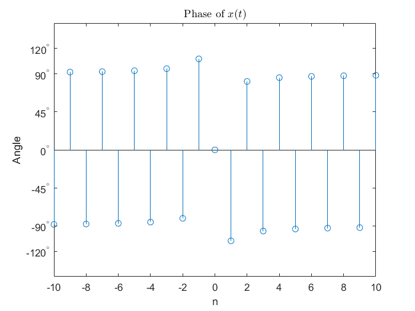

# HW-01

## problem 01

## problem 02

## problem 03

## problem 04

## problem 05

## problem 06

## problem 07

### References

- [Fourier 级数与 Parseval 恒等式 - 知乎](https://zhuanlan.zhihu.com/p/118249951)
- [Parseval's theorem - Wikipedia](https://en.wikipedia.org/wiki/Parseval%27s_theorem)
