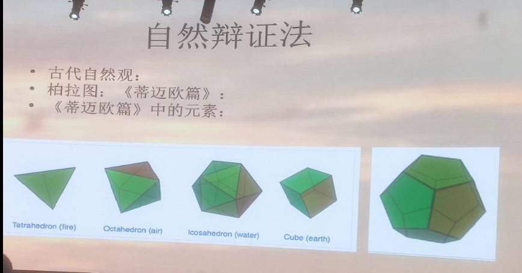

# 自然观(上)

- time: 2023-09-04

## 古代自然观

- 古代自然观
- 古希腊前苏格拉底自然哲学

- 古希腊当时已经有了对自然"冷热干湿"的初步感受
- 泰勒斯一派从"世界由什么构成"思考, 思想中蕴含了物质的转化思想
- 毕达哥拉斯派从"世界的本质是什么, 规律是什么"出发
- 柏拉图的蒂迈欧篇结合上述两者

> 在日后的科学当中有影子

## 朴素唯物主义自然观

### 主要观点

- 自然界是物质的,生成的,相互联系和运动变化的
- 自然界的本原是某一种或几种物质,或某种抽象的东西
- 自然界不是静止不变的,而是运动变化的
- 生物是进化的,并在其中分化出了人

### 缺陷

- 不能彻底地坚持唯物主义
- 不能满足民众的需要
- 不能科学地说明自然界

### 作用

- 成为马克思主义自然观和方法论的思想渊源
- 成为近代自然科学发展的思想基础
- 成为当代生态白然观和生态文明观的思想渊源

## 中世纪

> 罗吉尔·培根对中世纪思想状况的批评:
>
> 在掌握真理方面,现在有四种主要的障碍...无论人们怎样学习,都无法弄清楚他所学的问题而总是屈从于[1]谬误甚多,毫无价值的权威;[2]习惯的影响;[3]流行的偏见;以及[4]由于我们认识的骄妄虚夸而来的我们自己的潜在的无知.
>
> 还有更坏的是,人们受蔽于这四种错误的迷雾而不感觉到自己的无知,反而以各种谨慎的遁辞来保卫它...他们便把最坚不可摧以致找不到补救的方法的真理看成是极端荒谬的,把我们的最大的福祉看成是无足轻重的...相反地,他们却宣扬那虚假的东西,赞美那最坏的东西,颂扬那最卑鄙的东西...由于他们们的过度愚蠢,在一件贤明者判定为无聊的无用的,没有价值的事情上,他们作出了自己最大的努力,浪费了很多时间,支出了大量费用.因此首先必须认清这四个原因的暴行和毒害的一切罪恶,谴责它们,并将它们远远地排斥在科学的考察之外.

## 近代西方自然观

对亚氏经院哲学的讽刺:

渊博的博士问我,是什么原因,鸦片烟能使人睡着? 我的回答是,因为它有睡眠的力(vertus dormitiva), 所以自然有催眠的感觉

> 有种用答案证明问题的感觉, 没有实质上逼近问题. 为了亚氏形式而形式

---

波义耳论目的论解释的缺陷:

要想解释一种现象,把它归于一种一般的动力因是不够的,我们还必须清楚地表明那种一般的原因是如何具体产生相关结果的.如果一个人需要得到关于钟表现象的解释,却满足于被告知它是由一个钟表匠制造出来的机械,则他必定是一个非常愚钝的研究者,因为由此并没有说明钟表的发条,齿轮,摆轮等零件的结构和接合以及它们是如何协调作用以使表针指示出正确时间的.

---

- 疏远亚里士多德式的经院哲学
- 数学方法
- 经验研究的精神
- 天上-地下的统一
- 微粒-原子论(机械唯物论)

## local

### 泰勒斯

<docs-expose>

- link: [Thales of Miletus - Wikipedia](https://en.wikipedia.org/wiki/Thales_of_Miletus)
- 学说: 万物皆水
- 局限: 无法解释火

</docs-expose>

### 阿那克西曼德

<docs-expose>

- link: [Anaximander - Wikipedia](https://en.wikipedia.org/wiki/Anaximander)
- 学说: 万物由无限者构成
- 局限: 过于抽象

</docs-expose>

### 阿那克西美尼

<docs-expose>

- link: [Anaximenes of Miletus - Wikipedia](https://en.wikipedia.org/wiki/Anaximenes_of_Miletus)
- 学说: 万物皆气

符合无限, 且有了具体的事物

</docs-expose>

### 恩培多克勒

<docs-expose>

- link: [Empedocles - Wikipedia](https://en.wikipedia.org/wiki/Empedocles)
- 学说: 万物皆由四种元素构成: 土, 水, 火, 气

对应了古希腊朴素的冷热干湿的基本感受划分

</docs-expose>

### 阿那克萨戈拉

<docs-expose>

- link: [Anaxagoras - Wikipedia](https://en.wikipedia.org/wiki/Anaxagoras)
- 学说: 万物由种子构成
- 局限: 每解释一个东西, 就需要引入一个新的种子, 过于复杂

</docs-expose>

### 德谟克利特

<docs-expose>

- link: [Democritus - Wikipedia](https://en.wikipedia.org/wiki/Democritus)
- 学说: 万物皆由原子构成

人为什么能看到东西? 人的眼睛发出原子, 原子碰到物体, 反弹回来, 人的眼睛接收到反弹回来的原子, 所以人才能看到东西 (类似这也的表达, maybe) 或者是事物会发出原子, 原子碰到人的眼睛, 所以人才能看到东西

火为什么会给手灼烧的感觉? 火是尖锐的, 火的原子会刺破人的原子, 所以人才会感觉到疼痛 -> 关于物体属性和信息传递的思考

</docs-expose>

### 毕达哥拉斯

<docs-expose>

- link: [Pythagoras - Wikipedia](https://en.wikipedia.org/wiki/Pythagoras)
- 学说: 数

</docs-expose>

### 柏拉图

<docs-expose>

- link: [Plato - Wikipedia](https://en.wikipedia.org/wiki/Plato)
- 学说: 形式/理念

洞穴寓言

形式: 具备基本的数学理论, 能看懂没有见过的证明

关于世界的解释: 结合了元素和数的概念

- fire: 尖锐的, 所以三角形, 且轻盈, 所以面数少. 即考虑了密度
- 最后一个代表了天体

</docs-expose>

### 亚里士多德

<docs-expose>

- link: [Aristotle - Wikipedia](https://en.wikipedia.org/wiki/Aristotle)

成为了后来科学的障碍

> 近代为了克服亚里士多德的学说, 机械唯物主义自然观需要不少理论创新

</docs-expose>
