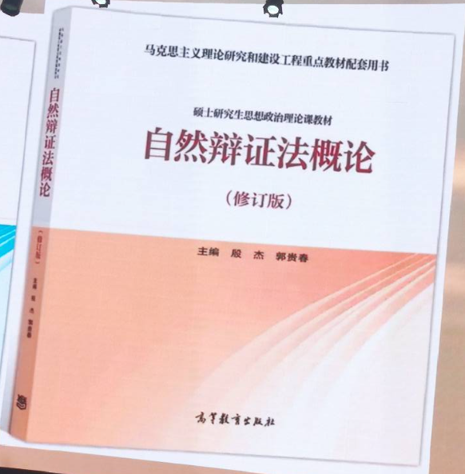

# 自然辩证法

- 开卷考试

<a class="Pages" target="_blank" href="assets/syllabus.pdf">syllabus</a>

> 老师: 思政有什么用? 就是像是城中墙一样, 平时生活的时候, 没有人会去注意, 但是城墙破了或者有人试图侵犯时, 它就会发挥价值. 或者就像小区围起来的门和墙, 不要觉得平时不需要就不去建设.

> ??: 无论学与不学, 哲学都会潜在支配的人的思想. 人往往容易追逐当下 fashion 的概念, 而忽视过去已经总结成熟的经典概念

- [Stanford Encyclopedia of Philosophy](https://plato.stanford.edu/)

## 基本框架

- 自然观
  - 朴素唯物主义自然观 -> 古代自然, 古希腊
  - 机械唯物主义自然观 -> 近代科学, 伽利略, 牛顿
- 科学观
- 技术观
- 科学, 技术与社会
